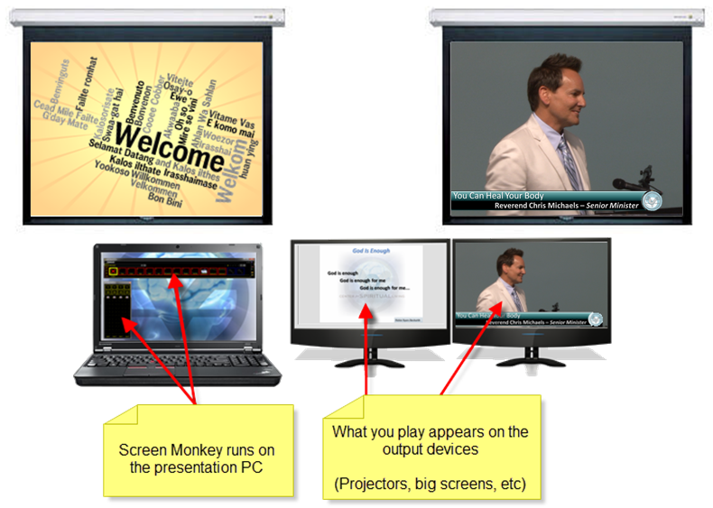

<h1>What Screen Monkey Does</h1>

Screen Monkey is software that allows you to easily control presenting 
 media content on other display devices connected to your computer. 

If Screen Monkey did not exist, you would likely see lots of fumbling 
 around as PowerPoint presentations are loaded up and started. There would 
 likely be delays and potentially be mix-ups as various Media Players are 
 started and loaded on the computer to present video clips or play songs. 
 Perhaps the players would need to be dragged from the primary monitor 
 to the second in order for the audience to see them. In order to present 
 a live video feed coming from a camera, you might need to resort to an 
 A/B switch to control what is sent to the projector. This provides for 
 a &quot;less than optimal&quot; presentation.

Screen Monkey allows you to easily manage all this and more in order 
 to provide a seamless and professional presentation. Playing videos, music, 
 PowerPoint, live video content or other elements becomes as simple as 
 clicking the mouse.

