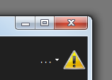

# Events and Errors

No one likes to get an error message, least of all in the middle of an important show. That’s why a lot of effort is put into ensuring that Screen Monkey runs without problems. However, if something should go wrong it should be handled automatically.

Instead of showing an error message in the middle of a show, any errors are handled automatically and saved in a log for you to look at later. If an error does occur you will be notified by the appearance of an exclamation mark in the toolbar. If a clip will not run or has problems loading, you may click the exclamation icon to learn more about the problem.

Once you have viewed the new events the exclamation mark in the toolbar will disappear.

You may also save a copy of the log. This may be useful to send to Screen Monkey support. After analyzing the information, they may be able to help prevent the problem from occurring again.

If the exclamation mark is not visible and you want to look at the events log then it can be also accessed from the [General Settings](Settings/General.md).

A list of all events that have occurred are shown and can be filtered to only show events that have occurred since you started the program, the last 24 Hours or all events that have ever occurred.

When you double click on an event in the list, more detailed information about that event is presented.

If something goes wrong and you need to report it to Screen Monkey support, it is helpful if you attach a copy of this event log. You can save a copy of the log by selecting ‘Save Event Log’.

