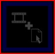

Quick Reference
===============

Loading a Clip
--------------

Drag the file from Windows Explorer and drop it onto one of the empty panels or click on an empty panel.

You can set the name, and effect from the drop down menu.

Running the Show
----------------

1.  Click the desired clip using the mouse and its border will turn yellow to indicate it is being presented.  
      
      
    
2.  To play another clip, click to select that clip.
    
3.  To clear the active clip, click to select the Clear Panel.  
      
    
    
4.  To advance a PowerPoint slide click on the clip panel using the mouse or use the left and right arrow keys.
    

Useful Hotkeys
--------------

1.  Running the Show
    
|Key|Action                                                 |
|---|-------------------------------------------------------|
|F1|Clears all clips and turns off any output to the screen.|
|F2|Plays the clip in Panel 1|
|F3|Plays the clip in Panel 2|
|F4|Plays the clip in Panel 3|
|F5|Plays the clip in Panel 4|
|F6|Plays the clip in Panel 5|
|F7|Plays the clip in Panel 6|
|F8|Plays the clip in Panel 1 on the next page|
|F9|Plays the clip in Panel 2 on the next page|
|F10|Plays the clip in Panel 3 on the next page|
|F11|Plays the clip in Panel 4 on the next page|
|F12|Plays the clip in Panel 5 on the next page|

2.  Program Control
    
|Key|Action                                                 |
|---|-------------------------------------------------------|
|Ctrl + H|Hides the Screen Monkey Control Window|
