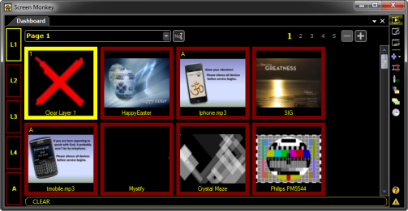

<h1>General</h1>

Click the area of interest on the image below to learn more about that 
 option.

<map id="MAP419532842" name="MAP419532842">
<area shape="rect" coords="6, 25, 133, 39" href="General.md" alt="">
<area shape="rect" coords="6, 41, 133, 57" href="DisplayRenderer.md" alt="">
<area shape="rect" coords="6, 59, 133, 75" href="ACN.md" alt="">
<area shape="rect" coords="6, 77, 133, 93" href="Artnet.md" alt="">
<area shape="rect" coords="6, 94, 133, 110" href="CITP.md" alt="">
<area shape="rect" coords="6, 112, 133, 128" href="Network.md" alt="">
<area shape="rect" coords="6, 129, 133, 145" href="MouseandKeyboard.md" alt="">
<area shape="rect" coords="6, 147, 133, 163" href="MIDI.md" alt="">
<area shape="rect" coords="6, 164, 133, 180" href="ProUpgrade.md" alt="">
<area shape="rect" coords="6, 182, 133, 198" href="Statistics.md" alt="">
<area shape="rect" coords="154, 45, 235, 59" href="#Show_Clip_Names" alt="">
<area shape="rect" coords="154, 60, 443, 74" href="#Enable_Global_Hotkeys" alt="">
<area shape="rect" coords="154, 75, 460, 89" href="#Generate_Thumbnails" alt="">
<area shape="rect" coords="150, 108, 224, 122" href="#Always_On_Top" alt="">
<area shape="rect" coords="150, 123, 385, 137" href="#Show_Infobar" alt="">
<area shape="rect" coords="150, 137, 244, 151" href="#Double_Click_to_Play" alt="">
<area shape="rect" coords="150, 157, 340, 177" href="#Style" alt="">
<area shape="rect" coords="348, 157, 553, 177" href="#Panel_Size" alt="">
<area shape="rect" coords="348, 178, 553, 198" href="#Toolbox_Size" alt="">
<area shape="rect" coords="150, 179, 340, 199" href="#Page_Stride" alt="">
<area shape="rect" coords="153, 215, 469, 235" href="#Auto_Save" alt="">
<area shape="rect" coords="462, 313, 557, 340" href="../EventsandErrors.md" alt="">
<area shape="rect" coords="153, 256, 556, 277" href="#Profile" alt="">
<area shape="rect" coords="153, 276, 261, 292" href="#Use_Effect_on_Clip_Out" alt="">
</map> 

The General settings are split 
 into five areas:

<ul type="disc">
	<li>
<a href="#Clip_Preview">Clip Preview</a>
</li>
	<li>
<a href="#Dashboard">Dashboard</a>
</li>
	<li>
<a href="#Auto_Save">Auto Save</a>
</li>
	<li>
<a href="General.md#Display_Settings">Display Settings</a>
</li>
	<li>
<a href="General.md#Events_and_Errors">Events and Errors</a>
</li>
</ul>

&#160;

<h2>Clip Preview</h2>

This area contains settings related to how the Main Dashboard behaves 
 when playing back clips.

 

Show Clip Names

When enabled, the clip name is shown in the 
 bottom of the clip panel. (This setting is recommended to be on)

With Clip Names enabled:

With Clip Names disabled:

&#160;

Enable 
 Global Hotkeys

When enabled, global Hotkeys are enabled. 
 This means that the Hotkeys for Screen Monkey will work regardless of 
 which application has focus. With this option enabled the Hotkey will 
 always perform its function.

<table cellspacing="0" border="1" class="hcp9">
	<col>
	<col>
	<tr>
		<td class="hcp10"></td>
		<td>Be forewarned that enabling this function can make your keyboard 
		 seem as if certain keys no longer work. For example, if you have 
		 assigned the Arrow Left or Arrow Right keys to functions, Screen 
		 Monkey will intercept these keysrokes. You may be working in another 
		 application and notice the keys aren't working as you believe 
		 they should be.</td>
	</tr>
</table>

<a href="../../Hotkeys.md">Click here to 
 learn more about Hotkeys</a>.

&#160;

Generate 
 thumbnail images for clips

This option governs whether thumbnails are 
 generated from the clips' media content or not. When this option is turned 
 off the default clip logo will be displayed. This may speed up the load 
 time of clips such as video clips as Screen Monkey won't spend time generating 
 a thumbnail.

&#160;

<h2>Dashboard</h2>

This area contains settings related to how the Main Dashboard appears 
 in Screen Monkey.

&#160;

Always On Top

When enabled, the Screen Monkey Dashboard window will always be on top 
 of any other windows. This prevents other windows from obscuring the control 
 window.

&#160;

Show Infobar

Whether or not to display the info bar at the bottom 
 of the dashboard which displays information about the mouse over clip 
 or the live clip on the selected layer.

With 
 Show Infobar enabled:

With Show Infobar disabled:

&#160;

Double 
 Click to Play

The default behavior of Screen Monkey is to play a clip when it has 
 been single clicked. If this option is enabled, Screen Monkey will only 
 play a clip if it has been double-clicked.

&#160;

Style

The drop-down allows you to choose whether the Screen Monkey Dashboard 
 is presented as a Panel or a List.

<table cellspacing="0" border="1" class="hcp13">
	<col>
	<col>
	<tr>
		<td class="hcp10">Panel</td>
		<td></td>
	</tr>
	<tr>
		<td class="hcp10">List</td>
		<td></td>
	</tr>
</table>

&#160;

Panel Size

The drop-down allows you to choose whether the Screen Monkey Dashboard 
 is presented using Small, Medium or Large panels. This setting is ignored 
 if Screen Monkey is configured to present the Main Dashboard as a List.

&#160;

Page Stride

As you resize the Main Dashboard window, the slots are grouped according 
 to pages. The number of slots in any given page is determined by the size 
 of the window and whether Screen Monkey is configured to present Small, 
 Medium or Large clips. The drop-down here allows you more control over 
 how many clips are assigned to a given page.

<table cellspacing="0" border="1" class="hcp9">
	<col>
	<col>
	<tr>
		<td class="hcp10">
Dynamic
</td>
		<td>Screen Monkey determines the number dynamically based on Panel 
		 Size setting and size of Window.</td>
	</tr>
	<tr>
		<td class="hcp10">
100
</td>
		<td>Each Page contains 100 slots.</td>
	</tr>
	<tr>
		<td class="hcp10">
256
</td>
		<td>Each Page contains 256 slots.</td>
	</tr>
</table>

&#160;

<table cellspacing="0" border="1" class="hcp9">
	<col>
	<col>
	<tr>
		<td class="hcp10"></td>
		<td>The 255 clip option is specifically useful when controlling 
		 via <a href="../DMXControl.md">DMX</a> as it ensures that each 
		 page fits on a DMX channel.</td>
	</tr>
</table>

&#160;

Toolbox Size

This option allows you to choose whether the Toolbox icons in the Main 
 Dashboard are Large or Small.

<table cellspacing="0" border="1" class="hcp13">
	<col>
	<col>
	<tr>
		<td></td>
		<td>Large Toolbox icons are especially useful when using Screen 
		 Monkey on a touch screen.</td>
	</tr>
</table>

&#160;

<h2>Auto Save</h2>

Screen Monkey will automatically save your configuration file after 
 a set amount of time. This means that if the application should close 
 unexpectedly or the computer loses power, your show will be reloaded from 
 the last time it auto saved when you next start the software.

You can choose to auto save from 1 minute to 1 hour. Or you may choose 
 to turn it off.

&#160;

<h2>Display Settings</h2>

Screen Monkey allows you to work with all sorts of display devices. 
 Additional Monitors, Projection Systems, Lighting Systems, Midi devices, 
 etc. You may configure different profiles that allow you to accommodate 
 different situations and environments.

<table cellspacing="0" border="1" class="hcp9">
	<col>
	<col>
	<tr>
		<td class="hcp10">
		Profile</td>
		<td>See the <a class="rvts15" href="../DisplayProfiles.md">Display 
		 Profile</a> topic for more information.</td>
	</tr>
	<tr>
		<td class="hcp10">
		Use Effect on Clip Out</td>
		<td>When enabled, the effect of the last played clip is used to 
		 clear the effect when the Clear panel is pressed. If this is set 
		 and a fade to black was the last clip run then pressing clear 
		 would fade back to the desktop. (It is highly recommended to ensure 
		 this setting is enabled.)</td>
	</tr>
</table>

&#160;

<h2>Events and Errors</h2>

See the <a class="rvts15" href="../EventsAndErrors.md">Events &amp; 
 Errors</a> topic for more information.

You may also change the size of the thumbnail images of the clips presented in the dashboard. This is controlled by visiting the [Screen Monkey Settings](../../reference/setup/Settings/Settings.md).

## Autosave
Additionally, Screen Monkey has an ‘Auto Save’ feature that is enabled by default. The default increment is every 5 minutes, but you are able to change this to suit your taste in [General Settings](../Settings/General.md). Choices vary from Never to 1 Hour.
