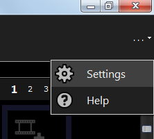

# Screen Monkey Settings

Screen Monkey has a number of user settings that allow you to configure the way it looks and operates. It's useful to know about these settings to ensure you configure Screen Monkey in the best way for what you want to achieve.

Please note that some of these settings are complex and may disable some useful and important functions so it's important to understand what they do.

To access the user settings, either right click anywhere in the dashboard and select ‘Settings’ from the popup menu or click on the dots icon at the right of the toolbar and choose ‘Settings’.

|||
|:-:|:-:|
|Menu|Toolbar|

The settings dialog is divided into a number of sections. Each section is described separately in this online document.