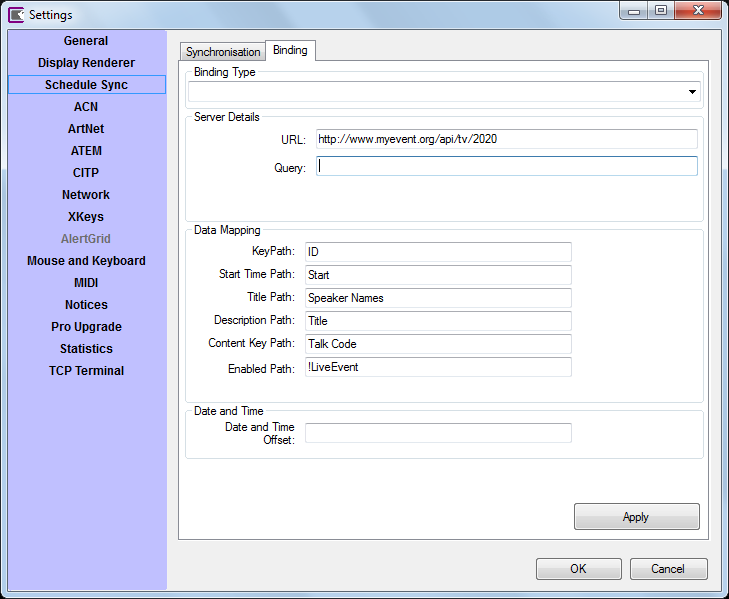
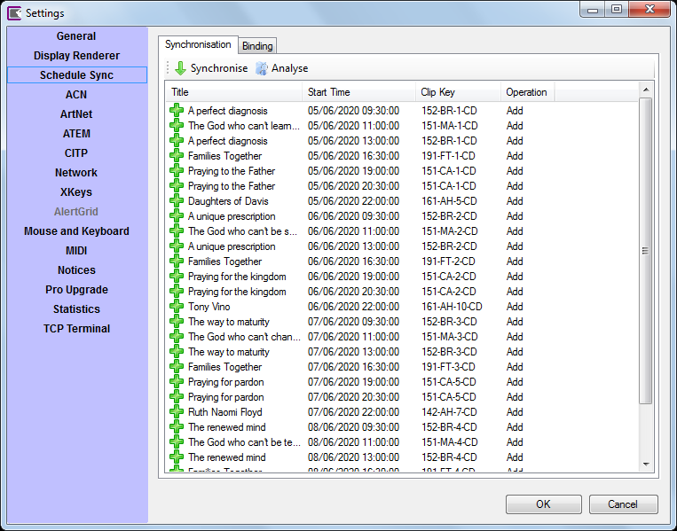

# Schedule Sync

The Schedule Sync tool automates the creation of [scheduled clips](../toolbar/schedule.md). It allows you to import schedule times, dates, titles and descriptions from an online CMS which can generate [JSON](https://www.json.org/json-en.html). 

*Note:* The Schedule Sync tool will not create any clips for you, any clips to be scheduled must be created before starting the sync. The sync process will look for existing clips in the show which match the JSON data and edit their schedule data. 

*Note:* Any type of clip can be used.

There are two tabs in the Schedule Sync section.

## Binding
The first step is to configure your feed on the Binding tab.

### Binding Type
For future use

### Server Details
- **URL** The URL from which the JSON data is retrived. This is normally a http server.
- **Query** Any additional parameters required in the URL (optional).

### Data Mapping
Screen Monkey requires the following data to be present in the JSON data feed.

|Field|Data|Format|
|--|--|--|
|Key|A unique identifier for the JSON schedule item|String|
|Start Time|The date and time at which the clip will be scheduled|DataTime `yyyy-MM-dd HH:mm:ss`|
|Title|A title which will be used in the onscreen schedule clip|String|
|Description|A description which will be used in the onscreen schedule clip|String|
|Content Key|A key which matches the JSON item to the clip name. This does not need to be unique, you can schedule the same clip multiple times.|String|
|Enabled|A flag which is used to determine if the clip will be enabled to run automatically. When set to disabled the event will still appear in the on screen schedule. To invert the meaning of the flag use a `!` (not) symbol before the key.|Boolean `0` or `1`|

### Date and Time
Optionally, you can set an offset which is added to all the datetime fields in the JSON data. This is in the form day:hour:minute:second. The offset can be entered as a negative value by prefixing a minus symbol. This function is useful for testing or re-using old JSON data.

## Syncronisation
Once the data binding is configured click on the Synchronisation tab and then click 'Analyse'. Screen Monkey will download the JSON data and parse it. The results will be displayed. If it all looks good click 'Synchronise'. If there are any problems try editing the key mappings on the Binding tab.

*Note:* You can synchronise as many times as you like. So if new data is added to the feed then just click Synchronise again.

## Example
Below is an example of a single schedule item which maps as per the screenshot above. 

*Note:* The JSON feed can include additional fields and these will be silently ignored.

*Note:* The data must be valid JSON and this may require the escaping of certain characters, for example \u201c.

    {
    "ID":"133",
    "Talk Code":"152-BR-1-CD",
    "Title":"A perfect diagnosis",
    "Subtitle":"Paul begins Romans in a good news, bad news way, however he begins with the realistically bad news. He explains how the wrath of God is being revealed and how all classes of all people do not have the righteousness which God requires. From the pagan (1:18-32) to the moralist (2:1-11) to the unreached (2:12-16) to the Jew (2:17-29), \u201cno one is righteous, not even one\u201d (3:9-20).",
    "Overview":"",
    "Speaker Code":"DCO",
    "Speaker Names":"David Cook",
    "Start":"2020-04-06 09:30:00",
    "End":"2020-04-06 10:45:00",
    "Passage":"Mark 4:35-41",
    "Series Title":"God's momentous news",
    "Series Overview":"Four Bible Readings giving an overview of Romans.",
    "Series Code":"BR",
    "LiveEvent":"0",
    "LiveFeed_URL":""
    }

