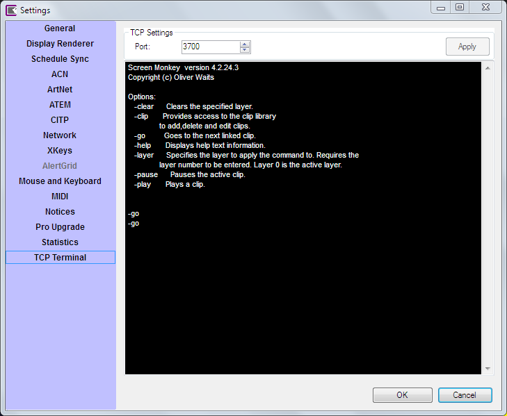
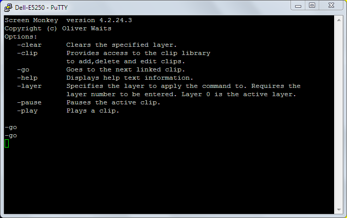

# TCP Terminal
It is possible to send control commands to Screen Monkey from a TCP telnet terminal. This section of settings allows you to set the TCP port and view a log of the commands received.

To use this feature open a TCP telnet session to the port defined in settings and the IP address of the computer running Screen Monkey. Commands are sent as ASCII text and are described in the on screen help. Commands must be followed by a newline character.

Commands maybe typed using a terminal utility such as PuTTY or sent from another application that is capable of sending TCP messages.

