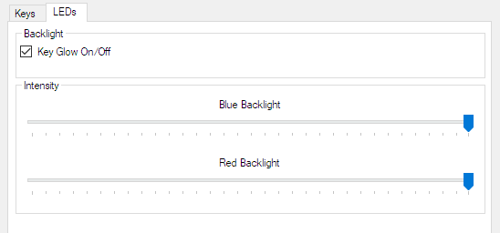

# X-Keys

**X-Keys requires a Screen Monkey Pro licence.**

These settings allow you to use a dedicated [X-Keys](https://www.x-keys-uk.com) programmable controller with Screen Monkey. This is a great way of quickly interacting with the software during a live show. 

The process of assigning an X-Key to an action is similar to that described in [Mouse and Keyboard Settings](MouseandKeyboard.md).

There is an additional tab for configuring the red and blue LEDs which are inside every key on the X-Keys controller.

