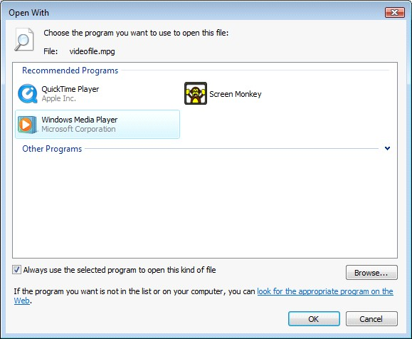

<h1>File Association</h1>

The Microsoft Windows operating system allows you to associate file 
 types with applications. Once a file type has been associated, you are 
 able to double-click it and the associated application will open.

You may wish to associate certain file types with Screen Monkey so that 
 when you double-click the file in windows they are added as a clip and 
 immediately begin playing on the active layer.

To associate a file type, right-click the file you want to associate 
 and choose &quot;Open With&quot;. Now select &quot;Choose Default Program...&quot;. 
 

This will open the &quot;Open With&quot; dialog from which you need 
 to select &quot;Browse&quot;.

Please note that Screen Monkey will not appear in the &quot;Recommended 
 Programs&quot; list if this is the first time you have associated the 
 file. Select the ScreenMonkey.exe from the installation folder and click 
 OK.

If you always want this file type to open and play in Screen Monkey, 
 ensure you enable the option &quot;Always use the selected program&quot;.

Click OK and the file will open and play in Screen Monkey.

