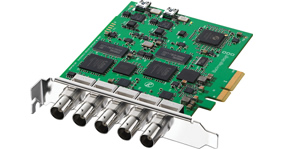
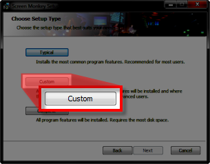
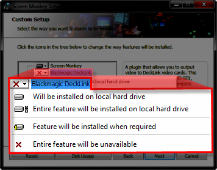
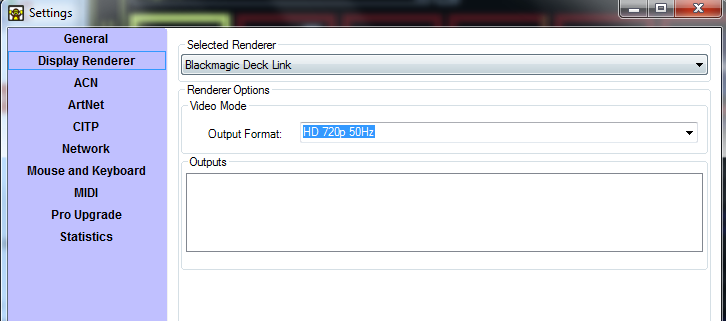

<h1>Black Magic DeckLink</h1>

The BlackMagic DeckLink renderer can send the video output of Screen 
 Monkey to any DeckLink output for direct SDI playback. If you are working 
 in a broadcast environment then this renderer offers direct SDI display 
 without the need for a scalar or converter. It also allows Screen Monkey 
 to generate content at the correct resolution for broadcast. This option 
 is not installed by default so you will need to select to install it by 
 following the custom setup route.

 

Once installed it will appear in the list of renderers available from 
 Settings &gt; Display Renderer. You can select &quot;Blackmagic Deck Link&quot; 
 from the list of renderers. Any cards you have connected will appear in 
 the outputs list.

You need to ensure that you select the correct output format for the 
 equipment you are using. Only standard broadcast formats are supported.

The default is for Screen Monkey to output on all connected DeckLink 
 outputs but you can disable the output by clearing the output option from 
 the outputs list.

The &#160;renderer can output different video to each output. You must 
 configure which output you want to display each layer on by changing the 
 monitor setting in the display profile. The Primary Monitor will always 
 output to the first DeckLink output and the Secondary to the next. If 
 you choose the &quot;Primary Full Screen&quot; display profile, all layers 
 will output to the first DeckLink output.

&#160;

<h2 class="rvps3">Enhancement History</h2>

<a href="../../releases/Version_3_7.md#BlackMagicDeckLinkRenderer">Version 
 3.7 - July 2012: Blackmagic DeckLink Renderer</a>

