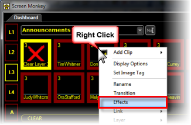
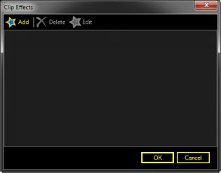
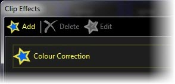
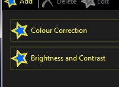
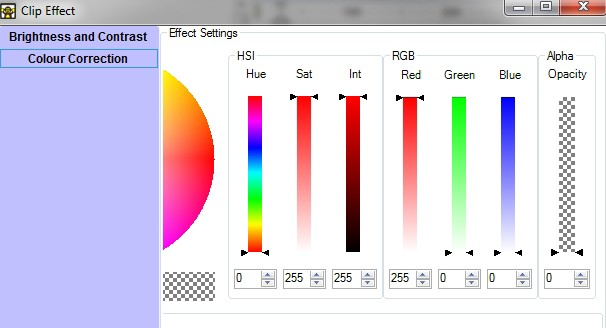
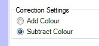
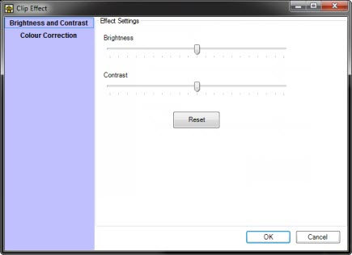

<h1>Effects</h1>

<a href="#MiniTOCBookMark2" class="hcp2">What Effects are</a>

<a href="#MiniTOCBookMark3" class="hcp2">How to configure Effects</a>

<h2>What Effects are</h2>

Effects are applied to individual clips and allow you to change the 
 properties of those clip for the duration of their playback.

For example, an effect may adjust the color of a clip. 

&#160;

<h2>How to configure Effects</h2>

To add an effect, right click on the clip and select Effects.

The Clip Effects dialog is presented.

Click Add to display a list 
 of possible effects to be applied. Choose the effect and make the desired 
 adjustments. Once you are finished the effect will be added to the effects 
 list.

A clip can support multiple effects so you may want to add more than 
 one effect to a clip.

When you play the clip your selected effects will be applied to the 
 clip. The effects allow you to edit the parameters while the clip is running 
 to make it easy to get the desired look.

<ul>
	<li>
Color Correction Effect 
	 
	Using this effect you can adjust the color of a clip when displayed 
	 on the screen.  
	 
	Once you add the effect you can use the color adjustment controls to 
	 change the clip. 
	 
	 
	 
	The color can either be adjusted by adding or subtracting color. 
	 
	 
	 
	Here are some examples or adding and subtracting red from a clip. You 
	 can adjust the settings while the clip is running to help you get 
	 the right settings.
</li>
</ul>
<table style="margin-left: 55px; border-collapse: separate; border-collapse: separate;" 
		 cellspacing="0" border="1">
	<col>
	<col>
	<tr>
		<td>
Normal
</td>
		<td></td>
	</tr>
	<tr>
		<td>
Subtract Blue 
		 and Green
</td>
		<td></td>
	</tr>
	<tr>
		<td>
Add Red
</td>
		<td></td>
	</tr>
</table>

&#160;

<ul>
	<li>
Brightness and Contrast Effect 
	 
	The brightness and contrast effect allows you to adjust any clip which 
	 it is added to. Once the effect has been added to the clip adjust 
	 the brightness and contrast using the sliders. A reset button allows 
	 you to return to the default settings. The settings can be modified 
	 while the clip is live to ensure you get the correct levels. 
	 
	 
	 
	Here are some examples of the effect applied to a clip.
</li>
</ul>
<table style="margin-left: 54px; border-collapse: separate; border-collapse: separate;" 
		 cellspacing="0" border="1">
	<col>
	<col>
	<tr>
		<td>
Normal
</td>
		<td></td>
	</tr>
	<tr>
		<td>
Increased 
		 Brightness
</td>
		<td></td>
	</tr>
	<tr>
		<td>
Reduced 
		 Contrast
</td>
		<td></td>
	</tr>
</table>

