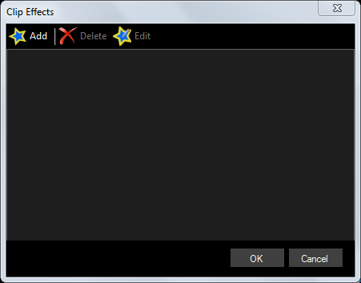
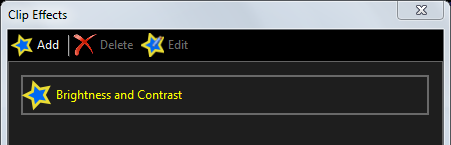
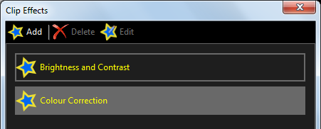
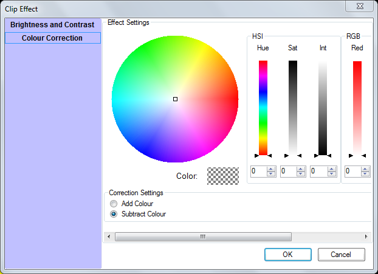
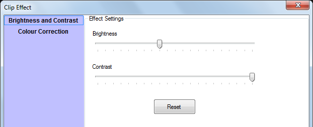

# Effects

Effects are applied to individual clips and allow you to change the display properties of the clip for the duration of their playback. For example, an effect may adjust the colour of a clip. Effect parameters can be adjusted while the clip is live which makes it easy to get the desired look.

## Add Effects
To add an effect, right click on the clip and select ‘Effects’ and the Clip Effects dialog is presented.

Click ‘Add’ to display a list of possible effects to be applied. Choose the effect, make the desired adjustments and click ‘OK’. The effect will be added to the effects list.

A clip can support multiple effects so you may add more than one effect to a clip.

When you play the clip your selected effects will be applied to the clip. 

## Colour Correction Effect  
Using this effect you can adjust the colour of a clip when it is presented on the screen. Add the effect and then use the color adjustment controls to change the look of the clip. The color can either be adjusted by adding or subtracting color.

  

Here are some examples for adding and subtracting red from a clip.

|Effect|Example|
|-|-|
|Normal||
|Subtract Blue and Green||
|Add Red||

## Brightness and Contrast Effect  
Once the effect has been added to the clip adjust the brightness and contrast using the sliders. A reset button allows you to return to the default settings. 

Here are some examples of the effect applied to a clip.

|Effect|Example|
|-|-|
|Normal||
|Increased Brightness||
|Reduced Contrast||

## Editing Effects
The effect settings can be modified while the clip is live to help you get the correct levels. 

Open the Effects dialog for the clip then click to select an effect

- To edit the effect press the ‘Edit’ button and then adjust the parameters and you will see the changes on the output
- To remove an effect first select the effect and then use the ‘Delete’ button.