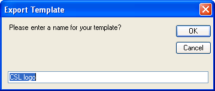
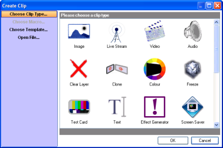
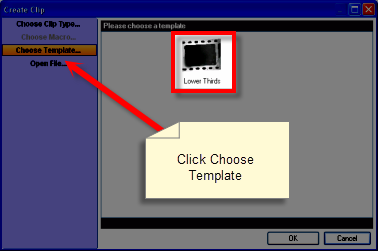

# Clip Templates
The Clip Template feature allows you to export any existing clip to be used as a template when creating new clips. The template includes all clip settings and allows you to quickly and easily duplicate the clip settings. For example, perhaps you find yourself performing the following steps:

Add an image clip
Configure the clip with a Fade Transition at Medium speed
Configure the clip so it plays on Layer three
Configure the clip so the Display Options have a Transparent Background Colour
	 
Using a Clip Template will ensure those settings are already applied, because they are part of the template.

## How to create a Clip Template
Create a clip and configure it with all the settings you wish to repeatedly use. As in the explanation above, perhaps it's an Image clip with the following settings:

Fade Transition at Medium speed
Layer three
Transparent Background Colour

After all settings have been applied, right-click the clip and choose Export Clip Template. The Export Template dialog should appear and suggest the Clip Name as the Template name.

Type a name you wish to use to identify the Template and press Enter or click OK.

## How to use a Template to create a Clip
Click on any empty square as if you were going to create any other clip type.

The Create Clip dialog should appear.

Click Choose Template... in the left panel and the available templates will be presented in the main part of the dialog.

Select the template you wish to use, click OK and select the media that you will be using.

## Notes
		
- If the template was saved from an Audio clip, the dialog filters to only audio files to make the selection. Likewise, if the template was saved from an Image clip, the dialog filters to only Images. 
		
- If you later save changes to the Clip Template, any existing clips are not affected. If you want the attributes applied to existing clips, you must apply them separately. 
		
- As many clips as you want may be created using the template. There is no limit. 
				
- If the Clip used to save the Template was scheduled, the schedule is part of the Template.
		
- Clip templates are stored as files bearing a .SMT (ScreenMonkeyTemplate) file extension in your Windows User settings. 
		
Windows 7
Libraries &gt; Documents &gt; Screen Monkey &gt; Templates
		
Windows XP
Documents and Settings\UserName\My Documents\Screen Monkey\Templates