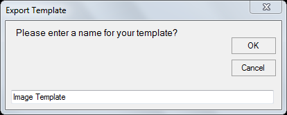
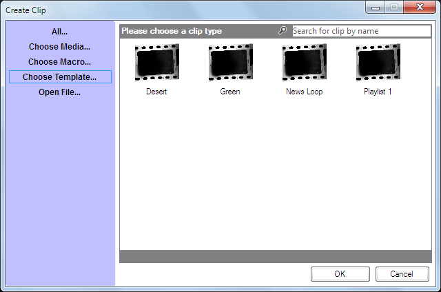

# Clip Templates
The Clip Template feature allows you to export any existing clip to be used as a template when creating new clips. The template includes all clip settings and allows you to quickly and easily duplicate the clip settings. For example, perhaps you find yourself performing the following steps:

- Add an image clip
- Configure the clip with a Fade Transition at Medium speed
- Configure the clip so it plays on Layer 3
- Configure the clip so the Display Options have a Transparent Background Colour
	 
If you need to create multiple clips with these settings then using a Clip Template will save you a lot of time and ensure all those settings are applied automatically.

## Create a new clip template
Create a clip and configure it with all the settings you wish to repeatedly use. After the settings have been applied, right-click the clip and choose ‘Export Clip Template’. The Export Template dialog will appear and suggest the Clip Name as the Template name. Type a name you wish to use to identify the template and press Enter or click OK.

## Use a template to create a new clip
Click on any empty dashboard slot as if you were going to create any other clip type. The Create Clip dialog will appear. Click ‘Choose Template...’ in the left panel and the available templates will be presented in the main part of the dialog. Select the template you wish to use, click OK. Then select the media that you wish to be associated with the new clip.

## Notes
- If the template was saved from an Audio clip the new media dialog filters to show only audio files to make the selection. Likewise if the template was saved from an Image clip the dialog filters to only images.

- Templates can be used to copy a complex clip setup between shows as they are saved completely independently from the show file.

- If you later make changes to the Clip Template any existing clips are not affected. If you want the attributes applied to existing clips you must apply them separately.

- There is no limit to the number of clips that can be created from a template		

- If the clip used to save the Template was scheduled then the schedule is part of the Template

- Clip templates are stored as files bearing a .SMT (ScreenMonkeyTemplate) file extension

- Clip templates are stored in `Users>[username]>Documents>Screen Monkey>Templates`

- To delete or rename a template use Windows Explorer