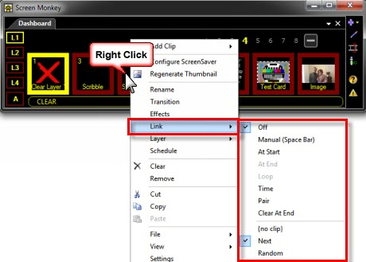
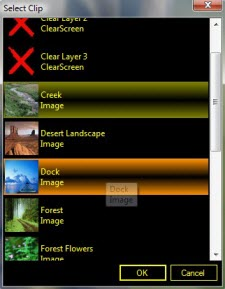
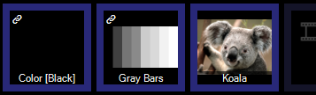
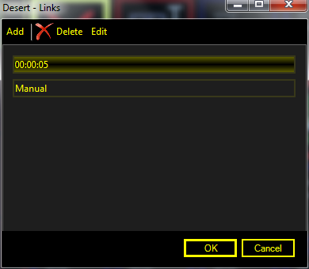
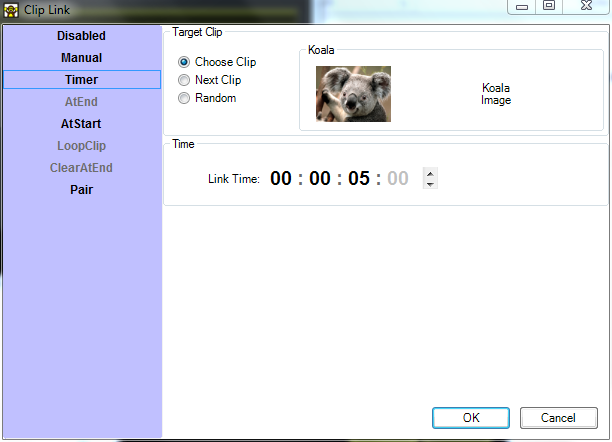

# Linking Clips
Linking clips gives you the ability to control precisely how clips play. Using links you can play one clip immediately after another, or after a time delay, or play when the Go (Spacebar) key is pressed and much more. 

Links may be used to create a slideshow, add music to slides, create a timed sequence, or even link media playback with control of external video hardware. By using links very complex shows can be highly automated.

All clip types can be linked from and to including spaces, playlists and macros. Some link types are only valid for clips with a known fixed duration, eg ‘At End’ will not work for images because they have infinite duration.

## Link Principles
Clip linking is a three step process:

- First you choose the clip you’re linking *from*
- Then decide *when* the link action will occur
- Next you choose which clip you are linking *to*.

A clip can be linked *from* and linked *to* multiple times. There are no limits on the number of links you can create.

## Link Menu
To quickly create a single link use the link menu. For managing multiple links use the link editor. 

To link a clip using the menu right-click the *from* clip to display the context menu and select Link > and then choose the type of link you wish to create from the sub-menu. The destination is set to ‘Next’ automatically but can be changed later.

## Link Types
The following link types can be used. You can add as many types as you need in any combination.

|Link Type|Description|
|-|-|
|Off|No link is set.|
|Manual|This clip will link to the next clip when the ‘Go’ key is pressed. By default the ‘Go’ key is the spacebar. This may be reassigned in the [Screen Monkey settings](../../Reference/Settings/Settings.md).|
|At Start|The linked clip will begin playing at the same time as the current clip. This link type is only valid for links to clips that play on other layers.|
|At End|The linked clip will begin playing when the current clip finishes. This type is only applicable to clips which have a duration, such as audio or video clips. On a clip such as an image this option will be disabled as an image clip has no end.|
|Loop|The current clip will begin playing again when it finishes. This is the equivalent of linking the clip to itself. This type is only applicable to clips which have a duration, such as video. On a clip such as an image, this option will be disabled as an image clip has no end.|
|Time|The linked clip will begin playing after a specified time. When you select this option you will be presented with a dialog to enter the time (hour:minuite:second:millisecond).|
|Pair|When you pair two clips together playing the one with the link also plays the other (typically on another layer). You may want to pair an audio clip with a text or image clip to create a slide with background music.|
|Clear At End|When the clip finishes playing, the layer is cleared. For example, perhaps you have an Audio clip. You click and the audio begins playing. As it completes the Audio layer is cleared and the clip returns to a normal state.

Below the link types the link destinations are shown.

|Link Destination|Description|
|-|-|
|{no clip}|Click {no clip} to manually choose the link destination clip. If {no clip} is shown then the destination is chosen automatically as the next available clip.|
|Next|When you choose Next, Screen Monkey links to the next clip in the list. The list will always play in clip order.|
|Random|When you choose a random link destination, Screen Monkey will select a random clip to link to. The random option can be useful it you want to shuffle the clip playback within a [space](../clipTypes/CueListSpaceClip.md).|

When you are creating a link, the default behavior is for Screen Monkey to try and link to the next available clip. If no clip exists in the next slot, Screen Monkey presents a window allowing you to select the clip you want to link to.

There are two clips shown in the image above that require explanation. These are the Clear Layer clips named “Clear Layer 3” etc. You may link to these clips to clear the indicated layer. This is very handy if you want something to appear, then disappear when it has finished.

If a clip has a link assigned a link icon is shown in the top left of the dashboard clip thumbnail.

## Link Editor
For more advanced use the link editor is required. This allows you to view, edit and delete multiple links on a single clip.

You can link a clip to multiple items rather than just a single clip. The default as before is to link to just a single clip but if you select either “More Options” or the “Link” option from the clip menu it will allow you to specify additional links.

Using the links editor you can add additional links to a clip or edit existing links. When you add or edit a link the following editor will open.

The link editor allows you to change the type of link, the target clip and any additional settings for each link.

## Link Edit Mode
Creating links on several clips individually can be tedious. You can quickly create or change multiple links in [link multi-edit mode](../toolbar/link.md) which is enabled from the toolbar. 
