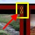

<h1>Linking Clips</h1>

Linking clips gives you the ability to play one clip after another or 
 when the GO key is pressed. Links 
 may be used to create a slide show of different clips but their capability 
 goes far beyond that. When one clip has been linked to another, the clip 
 you linked to will be played next.

To link any clip, right-click the clip to display the context menu, 
 select Link &gt; and choose type 
 of link you desire to create.

Note that linking is really a two part process 
 consisting of When and What. 

First you choose When 
 the link will occur. At Start, At End, At a specific Time. 

Then you choose What 
 clip you are linking to.

When you link clips together you have several link types to choose from:

<table style="margin-left: 12px; border-collapse: separate; border-collapse: separate;" 
		 cellspacing="0" border="1">
	<col>
	<col>
	<tr>
		<td>
Off
</td>
		<td>No link is set.</td>
	</tr>
	<tr>
		<td>
Manual
</td>
		<td>This clip will link to the next clip when the GO 
		 key is pressed. By default the GO key is the spacebar. This may 
		 be reassigned in the <a href="../../Reference/Setup/Settings/Settings.md">Screen 
		 Monkey settings</a>.</td>
	</tr>
	<tr>
		<td>
At 
		 Start 
</td>
		<td>The linked clip will begin playing at the same time as the 
		 current clip. This link type is only valid for links to clips 
		 that play on other layers.</td>
	</tr>
	<tr>
		<td>
At 
		 End
</td>
		<td>The linked clip will begin playing when the current clip finishes. 
		 This type is only applicable to clips which end such as audio, 
		 video or DVD. On a clip such as an image this option will be disabled 
		 as an image clip has no end.</td>
	</tr>
	<tr>
		<td>
Loop
</td>
		<td>The current clip will begin playing again when it finishes. 
		 This is the equivalent of linking the clip to itself. This type 
		 is only applicable to clips which end such as video. On a clip 
		 such as an image, this option will be disabled as an image clip 
		 has no end.</td>
	</tr>
	<tr>
		<td>
Time
</td>
		<td>The linked clip will begin playing after a specified time. 
		 When you select this option you will be presented with a dialog 
		 to enter the time.</td>
	</tr>
	<tr>
		<td>
Pair
</td>
		<td>When you pair two clips together playing the one with the link 
		 also plays the other (typically on another layer). You may want 
		 to pair an audio clip with a video clip so the audio plays whenever 
		 the video plays. You may also have a space clip with a play list 
		 of audio clips which you want to pair to a PowerPoint clip.</td>
	</tr>
	<tr>
		<td>
Clear 
		 At End
</td>
		<td>When the clip finishes playing, the layer is cleared. For example, 
		 perhaps you have an Audio clip. You click and the audio begins 
		 playing. As it completes the Audio layer is cleared and the clip 
		 returns to a normal state.</td>
	</tr>
	<tr>
		<td>
{no 
		 clip}
</td>
		<td>Once a clip has been linked the Clip name or label will appear 
		 here. Until you choose to link, you see {no clip}. </td>
	</tr>
	<tr>
		<td>
Next
</td>
		<td>When you choose Next, Screen Monkey links to the next clip 
		 in the list. The list will always play in clip order.</td>
	</tr>
	<tr>
		<td>
Random
</td>
		<td>When you choose a Random link, Screen Monkey will select a 
		 random clip to link to. The random option can be useful it you 
		 want to shuffle the clip playback within a <a href="../../reference/clipTypes/CueListSpaceClip.md">space</a>.</td>
	</tr>
</table>

When you are creating a link, the default behavior is for Screen Monkey 
 to try and link to the next available clip. If no clip exists in the next 
 slot, Screen Monkey presents a window allowing you to select the clip 
 you want to link to.

There are two clips shown in the image above that require explanation. 
 These are the Clear Layer clips named &quot;Clear Layer 3&quot; etc. You 
 may link to these clips to clear the indicated layer. This is very handy 
 if you want something to appear, then disappear when it has finished.

When a clip has a link assigned it is indicated by a link icon in the 
 clip panel border.

Creating links on several clips individually can be very tedious. Luckily 
 you can change the link in the multi-edit mode. <a href="SelectingMultipleClips.md">Click 
 here</a> for instructions on how to enter multi edit mode. The link operation 
 will mostly work the same in this mode but a few things behave differently.

In multi edit mode it may be possible to create a link list in a specific 
 order. Select the clips in the order you want them to play and enable 
 the link.

Once you have linked a clip it will not use the multi edit selection 
 order to assign the link. So you need a way to force the clips to be linked 
 in the selection order. You will notice when in multi edit mode the link 
 menu has a different option.

If you select Play In Selection Order 
 the links for the selected clips will be created in the order you selected 
 them.

&#160;

<h2 class="rvps3">Using Multiple 
 Clip Links</h2>

You can now link a clip to multiple items rather than just a single 
 clip as before. The default as before is to link to just a single clip 
 but if you select either &quot;More Options&quot; or the &quot;Link&quot; 
 option from the clip menu it will allow you to specify additional links.

Using the links editor you can add additional links to a clip or edit 
 existing links. When you add or edit a link the following editor will 
 open.

The link editor allows you to change the type of link, the target clip 
 and any additional settings for each link.

&#160;

<h2 class="rvps3">Enhancement History</h2>

<a href="../../releases/Version_3_7.md#37MultipleClipLiinks">Version 
 3.7 - January 2012: Multiple Clip Links added and announced</a>

