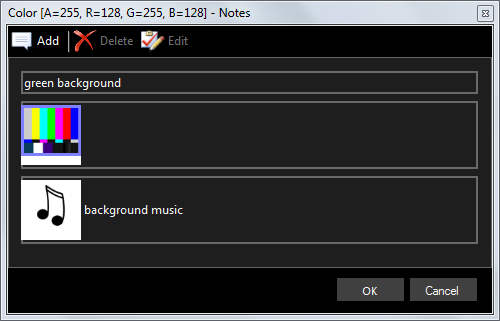

# Notes

Provides the ability to add text notes and additional icons to the clip.

The notes you write here are visible in the [notes viewer](../toolbar/notes.md) *when the clip is live*.

Notes can be added, edited and deleted using the buttons at the top of the window.

For each note you can set text, or an icon, or both.

