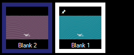

# Pin
The Pin feature is useful when you want a clip to appear on every dashboard page. Any clip slot can be pinned. Pinning mirrors the original and does not duplicate or copy the clip so any changes made to the clip on any page are made on all pages. 

## Pinning
To pin a clip right-click on the clip thumbnail to show the menu and choose 'Pin'. The menu item will be ticked to show the pin is active and a pin icon will appear in the top left of the clip thumbnail. If you pin a clip and the slot is already occupied on another page then the mirrored clip will not appear on that page.

## Un-Pinning
To remove the pin repeat the process above, right click and choose 'Pin'. 

- When you unpin the orignal clip all mirrored clips are removed but the original clip remains. 
- When you unpin a mirror of the original all mirrored clips including the one you unpinned will disappear but the original will remain.

## Page Clear
Mirrored pinned clips are not removed by the Page Clear command. This is a useful feature which means you can clear a page but retain a few important pinned clips.

The orignal pinned clip is removed by the Page Clear command if the page containing the original clip is cleared.

