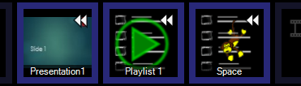

# Playback Settings

Two options are available in Playback Settings.

## Auto Rewind
*Applies only to clips which contain other clips, eg Playlist, and to PowerPoint clips.*

With this option ticked the clip will restart from the beginning of the list every time it is played. With this option unticked the clip will continue from the last list item played.

When enabled the clip thumbnail will show a rewind icon.

## Loop
*Applies only to clips which contain other clips, eg Playlist, and to PowerPoint clips.*

With this option ticked the clip will play forever. When it reaches the end of the list it will start again at the beginning.

When enabled the clip thumbnail will show a loop icon.

