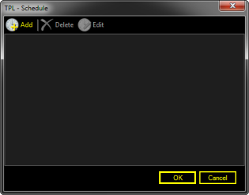
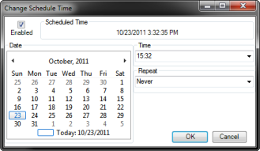
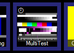
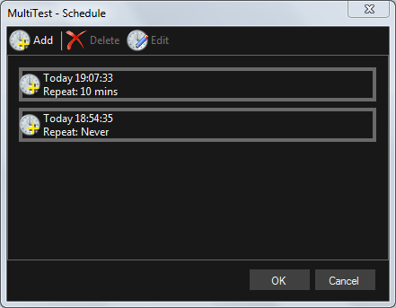

# Schedule

Screen Monkey allows you to configure pre-determined dates and times for clips to play. This may be useful for a TV station where programmes and adverts play at a specific times. Or perhaps you are using Screen Monkey for a concert and an intro should begin playing at a pre-determined time. To see an overview of the complete schedule for all clips use the [schedule viewer](../toolbar/schedule.md) toolbar item. 

Advanced users can [import a complete schedule](../Settings/scheduleSync.md) for multiple clips including titles and descriptions from a JSON API service.

*Note:* Screen Monkey needs to be running for the schedule to work. Configuring a schedule for clips does not configure a timer in the PC that will start Screen Monkey and present the clip. If Screen Monkey has been closed then the schedule has no meaning. If the scheduled time has been passed, Screen Monkey will not re-schedule or remind you that a schedule was missed.

## Schedule a clip to play
Right-click the clip and choose Schedule. The Schedule view dialog is shown.

Click Add. The Change Schedule Time dialog is shown.

Ensure the Enabled option is ticked, then set the Date, Time and Repeat options you require and click OK. In dashboard the clip will then show a clock icon to indicate that it has a schedule attached. A clip can be scheduled multiple times. 

## Viewing and Editing Schedules
Right-click the clip and choose Schedule. The Schedule view dialog is show. Existing scheduled times will be listed, both past and future. For repeating schedules only the next time is shown. Click a time and then click ‘Edit’ or ‘Delete’ as required.

