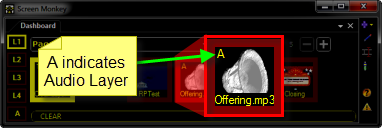
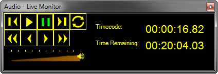

<h1> 
 Audio Clip</h1>
<h2>What an Audio Clip does</h2>

The Audio Clip allows you to play an Audio file from the computer.

&#160;

<h2>How to configure an Audio Clip</h2>

Click or Right-click a slot and choose Audio.

You are presented with a file browsing dialog from which you may browse 
 the PC file system and select the Audio clip you wish to use.

Aside from assigning a <a href="../../tutorials/WorkingWithClips/Transitions.md">Transition</a> 
 such as fading In, there are no other configuration options.

<table cellspacing="0" border="1" class="hcp5">
	<col>
	<col>
	<tr>
		<td></td>
		<td>You may also click and drag audio clips from Windows Explorer 
		 to Screen Monkey to add audio.</td>
	</tr>
</table>

The supported audio formats are:

<ul type="disc">
	<li>
*.AAC
</li>
	<li>
*.M4A
</li>
	<li>
*.MP2
</li>
	<li>
*.MP3
</li>
	<li>
*.WAV
</li>
	<li>
*.WMA
</li>
</ul>

When an audio clip has been added, it is automatically assigned to the 
 Audio Layer and the clip has an A 
 indicating this.

When playing an MP3 file that has an ID3 tag with album artwork, the 
 artwork is used as the thumbnail for the clip. Otherwise the default audio 
 clip icon is used.

&#160;

<h2>How to use an Audio Clip during a show</h2>

When presenting a show, you click the clip inside Screen Monkey to begin 
 playing it. Clicking the clip again will pause playback. 

You may wish to use the <a href="../../tutorials/WorkingWithShows/LiveMonitor.md">Live 
 Monitor</a> in order to see other playback controls as well as keep an 
 eye on elapsed time and time remaining.

<table cellspacing="0" border="1" class="hcp5">
	<col>
	<col>
	<tr>
		<td></td>
		<td>
		As of this writing (10/03/2011) Screen Monkey has no capability 
		 to play audio files directly from a CD inserted in the drive. 
		 If you have a need for a file on CD, you will need first to rip 
		 it to a compatible file format so it exists as a file on your 
		 PC.</td>
	</tr>
</table>

&#160;

<h2>Enhancement History</h2>

<a href="../../releases/Version_3_3.md#AudioCue">Version 3.3 - 4th 
 July 2009: Cue</a> / <a href="../../releases/Version_3_3.md#Audio_Clip_Album_Art">Album 
 Art</a>

<a href="../../releases/Version_3_3.md#AudioVolume">Version 3.3 - 
 20th August 2009: Volume Fader</a> / <a href="../../releases/Version_3_3.md#WMA_Audio_Support">WMA 
 Support</a>

<a href="../../releases/Version_3_3.md#AudioPlayState">Version 3.3 
 - 19th September 2009: Play State</a>

<a href="../../releases/Version_3_3.md#AudioLoop">Version 3.3 - 9th 
 November 2009: Seamless Looping</a> / <a href="../../releases/Version_3_3.md#Audio_Clip_64_Bit_Support">64 
 Bit Support</a>

<a href="../../releases/Version_3_5.md#AudioWMAM4A">Version 3.5 - 
 July 2010: WMA and M4A Support</a>

<a href="../../releases/Version_3_5.md#AudioLayer">Version 3.5 - October 
 2010: Audio Layer</a>

<a href="../../releases/Version_3_6.md#AudioMute">Version 3.6 - April 
 2011: Audio Mute</a>

<a href="../../releases/Version_3_6.md#AudioAAC">Version 3.6 - May 
 2011: AAC Support</a>

