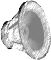
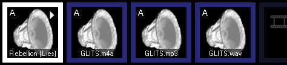
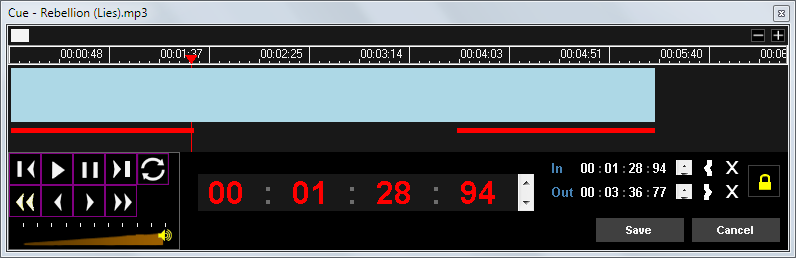
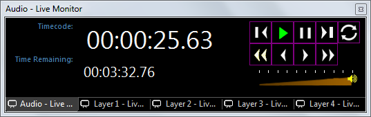

# Audio Clip

The Audio Clip allows you to play any audio file stored on your computer to the  audio ouptut. The audio output used is configured in Windows audio device settings.

*Note:* Screen Monkey has no capability to play an audio CD inserted in the computer CD/DVD drive. You will need first to rip it to a compatible file format so it exists as a file on your computer.

## Add an Audio Clip
There are three ways of creating audio clips.

- Click on any empty slot and choose the Audio clip. You are presented with a file open dialog from which you may browse the computer and select the audio file you wish to use.
-  You may also click and drag audio clips from Windows Explorer to the Screen Monkey dashboard.
- Click on an empty slot and choose 'Open File...' from the clip browser, using this method allows you to quickly add multiple files.

The supported audio formats are:

*   \*.AAC
*   \*.M4A
*   \*.MP2
*   \*.MP3
*   \*.WAV
*   \*.WMA

When an audio clip has been added, it is automatically assigned to the Audio Layer and the clip has an `A` in the top left corner indicating this.

## Configure an Audio Clip
A few options are available when right clicking on Audio clips.

### Mute
Choose the 'Mute' option to play the clip silently. Select 'Mute' again disable.

### Edit/Cue
The edit/cue dialog allows you to set In and Out points for the media so that the clip only plays a portion of the original file. There is also a volume adjustment which can be used to reduce the audio level if necessary.

*Note:* In and Out point cues are only supported when using the ffdshow audio decoder.

### Transition
Audio clips maybe faded in and out by applying an ['Audio and Video Fade' transition](../clipSettings/transition.md).

## Use an Audio Clip during a show
When presenting a show, you left click the clip icon on the Screen Monkey dashboard to begin playing it. Clicking the clip again will pause playback. Control-Click to restart the clip from the beginning.

You may wish to use the [Live Monitor](../toolbar/preview.md) in order to see other playback controls as well as keep an eye on elapsed time and time remaining.

