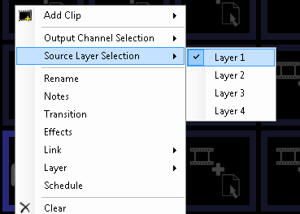
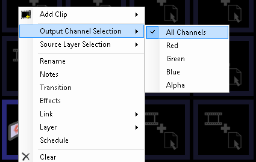

# Clone Clip

The Clone Clip allows you to duplicate one layer onto another. The clone can be filtered to only duplicate certain channels such as red, green, blue or alpha. The alpha channel is especially useful when combined with a vision mixer which supports separate alpha mask keying.

## Create a Clone Clip
Click on an empty dashbaod slot and choose 'Clone' from the create clip browser.

## Configure a Clone Clip
There are two special options for the Clone clip which are accessed by right-clicking on the dashboard clip thumbnail.

### Clone Source
Choose the source layer for the clip. Normally this would be different to the layer the clip is on.

### Clone Output Channel Filter
Choose which channel is duplicated to the output layer.

