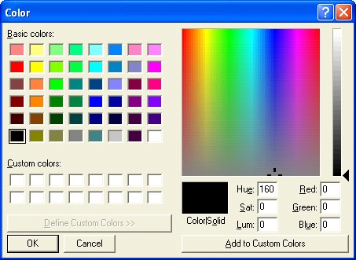

<h1> 
 Color Clip</h1>
<h2>What a Color Clip does</h2>

The Color Clip allows you to flood the screen with a color when you 
 play the clip. You may wish to use Color Clips to temporarily mask the 
 screen as you perform other activities. Or perhaps there is a point in 
 a church service where what is being projected is simply too bright. In 
 this case you might use the black color and fade it a bit to dim the projector 
 output to a more suitable level.

&#160;

<h2>How to configure a Color Clip</h2>

When a Color clip is added you are presented with a color 
 palette from which you may select the color you wish to use.

If the color you want is not in the palette, click Define 
 Custom Colors &gt;&gt; and a full color spectrum will be shown.

Once you have selected the color, click OK. 
 The Clip border will turn red and the slot will change to the reflect 
 the color you selected.

<table cellspacing="0" border="1" class="hcp3">
	<col>
	<col>
	<tr>
		<td></td>
		<td>If you wish to change the color used, you must <a href="../../tutorials/WorkingWithClips/DeleteClips.md">Clear 
		 the clip</a> and re-add it using the desired color.</td>
	</tr>
</table>

&#160;

<h2>How to use a Color Clip during a show</h2>

Perhaps you are playing a Video Clip on Layer 1 and you 
 have assigned the Color Clip to Layer 2. You click the Color clip and 
 floods the screen area of Layer 2 with whatever color was configured. 
 Layer 1 will continue playing along but will not be seen as the Color 
 Clip is now playing on Layer 2 and is covering Layer 1.

<table cellspacing="0" border="1" class="hcp3">
	<col>
	<col>
	<tr>
		<td></td>
		<td>Color Clips are a great way to gently fade other things into 
		 or out of view. You use them as a mask and combine them with the 
		 <a href="../../tutorials/WorkingWithShows/LayersDashboard.md">Layers 
		 Dashboard</a> to manipulate the fading.</td>
	</tr>
</table>

&#160;

<h2 class="rvps3">Enhancement History</h2>

<a href="../../releases/Version_3_6.md#ColorClipLiveMonitor">Version 
 3.6 - April 2011: Color Clip Live Monitor</a>

