 
# Cue List / Space Clip

A Cue List (Space Clip) is a special type of clip. It is a container which allows you to store a collection of related clips in one place and play them back either automatically or manually. 

This clip may help you better organize your Screen Monkey dashboard by hiding multiple clips behind one dashboard slot. The clip is also great for creating groups of releated clips.

*Note:* The [Playlist](playlist.md) and [Folder Search](folderSearch.md) clips are special types of Cue List and a most of the information here also applies to those clips.

For example, suppose you are using Screen Monkey to manage visuals for a concert with three different groups and several members in each group. You may choose to create a space clip for each group. Inside the space clip would be all the media assets related to the group.

If you didn't use space clips, your dashboard may look like this:

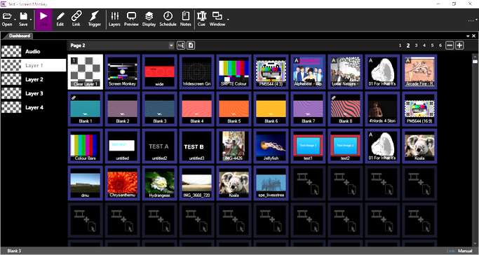

That's quite a jumble of clips and you might be hard pressed to determine which clip is what when you needed it. Using space clips you are able to easily organize them by group. In this case the same clips have been divided into four space clips. The spaces have been docked in a tabbed view at the right of the dashboard.

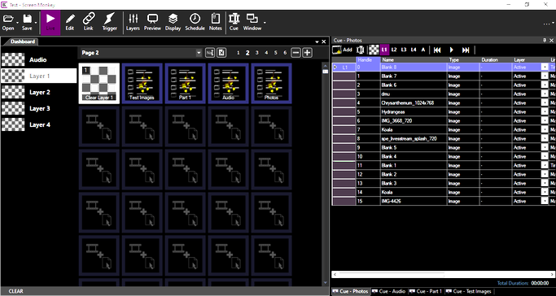

Normally the first clip you have added to the cue list will play when you play the Space Clip. Each successive click on the Space Clip in the main dashboard advances to the next clip listed in the cue.

## Create a Space Clip
When you click an empty dashboard slot and pick the Space clip you are prompted to provide a name to identify the space.

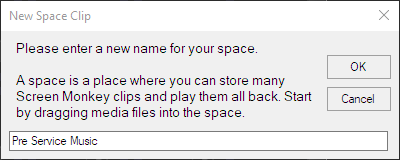

Type a name into the textfield and click OK. The Space clip is added to the dashboard.

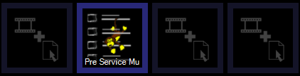

An empty cue list dialog will open into which you will add other clips.

There are four ways to add clips to the cue window.

*   Clicking the blank area of the cue window
*   Clicking the Add icon in the window toolbar  
*   Dragging files into the window from Windows Explorer
*   Dragging clips from the main dashboard

When you click the blank area of the Cue window or click the Add icon, Screen Monkey behaves in the same way it does when clicking an empty dashboard slot. It presents a dialog where you choose a clip type to add. Select the clip type and click OK.

Files may be dragged from Windows Explorer. If you are in [Edit mode](../toolbar/edit.md) you may click and drag clips from the Screen Monkey main dashboard to the cue window.

*Tip:* When dragging files from Windows Explorer onto an empty slot in the main dashboard you can press and hold the Alt key as you click and drag. This will cause a Space Clip to be automatically created that contains the selected files. This is a handy shortcut to creating spaces containing lots of clips.

## Configure a Space Clip
The Space clip icon on the dashboard may be renamed, linked to other clips, scheduled, assigned to a layer and have a transition applied just like a normal clip by using the [clip settings](../clipSettings/clipSettings.md) menu.

To edit the clips within a space clip first open the cue dialog by right clicking and slecting 'Edit Cue'. This dialog will float in the middle of the dashboard by default but maybe docked inside the dashboard or added to a tab view.

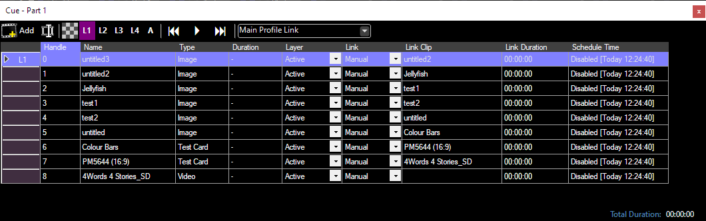

The cue dialog grid shows for each clip in the cue the handle, name, type, duration (if applicable), [layer](../layers.md), [link type](../clipSettings/link.md), link destination, link duration (if applicable) and [schedule](../clipSettings/schedule.md). Note that if a clip has muliple links or schedules then only one is displayed in this view but they are all still active.

### Cue List Ordering
The order in which clips will play from the cue is determined by the handle number. You may click and drag on the purple box at the far left of the dialog to re-order clips. 

### Settings
You can click once on any row to select it and then right-click to display the clip menu. You will have the same [clip settings](../clipSettings/clipSettings.md) and options as you would if the clip were on the main dashboard.

The 'Auto Rewind' setting determnines if the Space Clip always begins with the first item in the cue or if it continues from the item after the last played item.

Note that Space Clips offer their own layers and the clips with the Space Clip may also be assigned to individual layers. [Learn more about Layers](../layers.md).

## Use a Space Clip in a show
To play the items listed in a Space clip you click the Space clip in the main dashboard to activate it. The clip listed first (or the clip after the one last used) in the cue dialog will then appear on the screen or begin playing. 

Use the Edit / Cue menu option to open the cue dialog if it is not open.

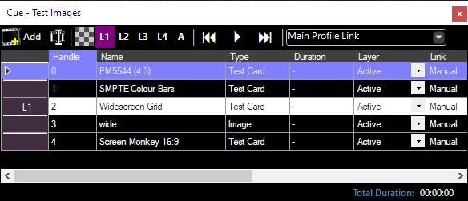

You will see that the live clip is highlighted in white (Widescreen Grid) and a layer indicator (L1) appears on the far left. You can change the active item whilst the Space clip is live by double clicking on a clip row in the grid.

### Toolbar
The cue dialog toolbar allows you to work with the clips that are part of the space.

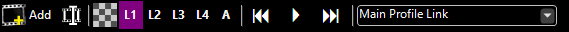

|Item|Description|
|-|-|
||Clicking the Add button opens the create clip dialog so you may add a new clip to the cue.|
||Clicking the Edit / Cue button opens the Cue dialog for the clip. This button only works for clips that support cueing, such as audio and video.|
|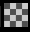|Clicking the Clear button will clear the active layer. To clear Layer 3 you would first click L3 to the right of the Clear button, then click the Clear button.|
|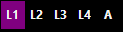|Clicking the layer buttons allow you to choose the active Layer. The selected active layer is used for the next clip to be played.|
|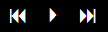|The triangle icon starts playing the clip, this is equivalent to double clicking a row in the grid. The double triangle icons advance to the next and previous clip.|
|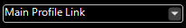|Clicking the Profile Selection will allow you to choose the [Display Profile](../toolbar/display.md) used by the Space Clip.|