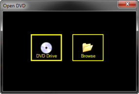
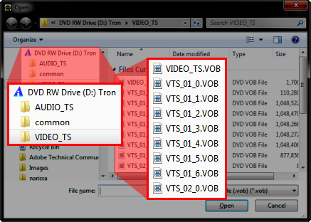
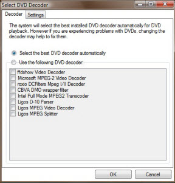
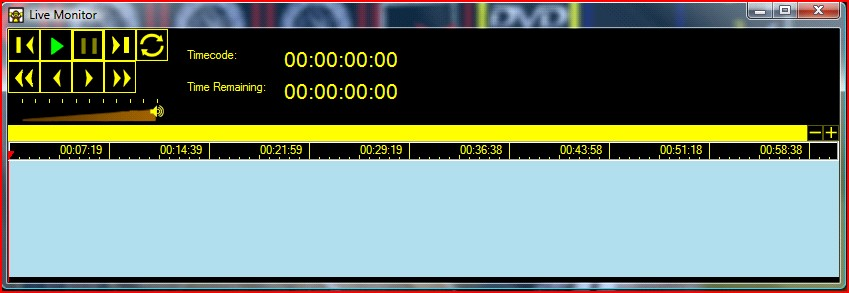
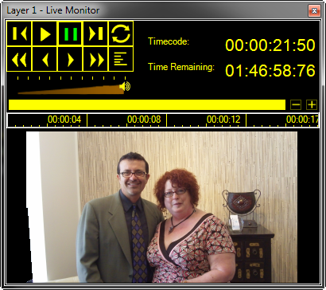

<h1> 
 DVD Clip</h1>
<h2>What a DVD Clip does</h2>

The DVD Clip allows you to play from a DVD that is inserted in the computer. 
 

&#160;

<h2>How to configure a DVD Clip</h2>

The first step is to ensure the DVD has been inserted into the DVD drive. 
 Then you either click an empty slot and choose DVD from the dialog or 
 right-click and choose Add Clip &gt; 
 DVD from the pop up menu.

The Open DVD dialog should display.

If you choose DVD Drive, the 
 dialog dismisses and you must open the Edit 
 / Cue dialog afterward to choose the bit you wish to play. 

If you choose Browse, a Windows 
 File browsing dialog should display allowing you to explore the contents 
 of the Windows file system. Choose the DVD drive, navigate to the VIDEO_TS 
 folder and choose a .VOB (Video Object) file to assign to the clip.

After you choose the VOB, you then must open the Edit 
 / Cue dialog to choose the bit you wish to play. Right-click the 
 clip in the main Dashboard and choose Edit 
 / Cue.

You are also able to use the Transition to Fade the DVD clip in and 
 out as it begins and ends as well as assign the clip to a specific layer. 
 

&#160;

<h2>DVD Options</h2>

The DVD options dialog allows you to change how Screen Monkey plays 
 DVDs. The default settings have been chosen to give you the best quality 
 and performance during playback. However, due to hardware and system limitations 
 you may occasionally experience problems. 

The options window allows you to change certain settings to give you 
 the best chance of playing your DVD. Unless you're experiencing problems 
 it's best to leave these settings as is. The settings here apply to all 
 DVD clips.

&#160;

<h2>DVD Audio Language and Special Feature Support</h2>

You can now select Audio languages and special features such as director's 
 commentary with DVD clips.

To set the language you first need to move to a point in the DVD that 
 supports languages. You can do this with the Cue control. Right-click 
 the clip and choose the desired language from the Audio 
 Languages sub menu. From now on that will be the language used.

&#160;

<h2>How to use a DVD Clip during a show</h2>

When presenting a show, you click the clip inside Screen Monkey to begin 
 playing it. Clicking the clip again will pause playback. 

You may wish to use the <a href="../../tutorials/WorkingWithShows/LiveMonitor.md" 
								 title="Here is where you type the popup info">Live 
 Monitor</a> in order to see other playback controls as well as keep an 
 eye on elapsed time and time remaining.

 
 
 

When a DVD clip is playing, the live monitor gives you an indication of the play position, the total time remaining and the current timecode. It also provides some live controls which may be used to control playback of the clip in real time.

 
 

During live presentation you may use the 
 <a href="../../tutorials/WorkingWithShows/LayersDashboard.md">Layers 
 Dashboard</a> to fade the video out and in manually as needed.

&#160;

<h2 class="rvps3">Enhancement History</h2>

<a href="../../releases/Version_1.md#ClipIconsDVDFreezeLiveVideo">Version 
 1 - 25th November 2005: Clip Icons</a>

<a href="../../releases/Version_2.md#DVDCueing">Version 2 - 4th May 
 2006: DVD Cueing</a>

<a href="../../releases/Version_2.md#DVDCueingTimeline">Version 2 
 - 31st July 2006: DVD Cueing Timeline</a>

<a href="../../releases/Version_2.md#VideoPausing">Version 2 - 12th 
 October 2006: Video Pausing</a>

<a href="../../releases/Version_3.md#DVDClipLiveMonitor">Version 3 
 - 11th March 2007: DVD Clip Live Monitor</a> / <a href="../../releases/Version_3.md#DVD_Clip_Cue_Export_and_Import">Cue 
 Export and Import</a>

<a href="../../releases/Version_3.md#VistaCompatibility">Version 3 
 - 27th August 2007: Vista Compatibility</a>

<a href="../../releases/Version_3.md#VMR9Upgrade">Version 3 - 27th 
 September 2007: VMR9 Upgrade</a>

<a href="../../releases/Version_3.md#VideoAndDVDVolume">Version 3 
 - 1st October 2007: Video and DVD Volume</a>

<a href="../../releases/Version_3_1.md#DVDOptions">Version 3.1 - 16th 
 March 2008: DVD Options</a> / <a href="../../releases/Version_3_1.md#DVD_Audio_Language_and_Special_Feature_Support">Audio 
 Language and Special Feature Support</a> / <a href="../../releases/Version_3_1.md#DVD_Menu_Button">Menu 
 Button</a>

<a href="../../releases/Version_3_1.md#TimelineResize">Version 3.1 
 - 18th April 2008: Timeline Resize</a>

<a href="../../releases/Version_3_2.md#DVDChapterTree">Version 3.2 
 - 5th January 2009: DVD Chapter Tree</a>

<a href="../../releases/Version_3_3.md#CannotSelectDVDChapters">Version 
 3.3 - 3rd March 2009: Cannot select DVD chapters</a>

<a href="../../releases/Version_3_3.md#DVDDriveQuickPlay">Version 
 3.3 - 21st September 2009: DVD Drive Quick Play</a>

<a href="../../releases/Version_3_4.md#DVDLinkAtEnd">Version 3.4 - 
 February 2010: DVD Link At End</a>

