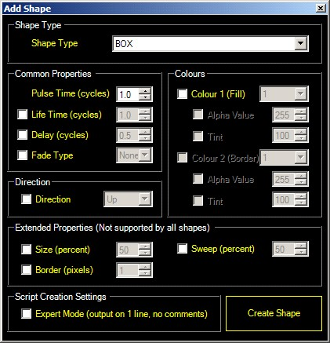
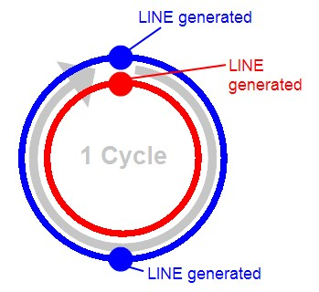
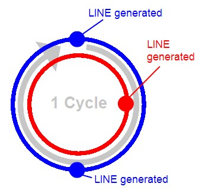

<h1 class="rvps6">Creating Custom Effects</h1>

This topic explains the concepts relating to the <a href="EffectsGeneratorClip.md">Effect 
 Generator clip</a> type, and how to create your own effect scripts

For reference information on the effect generator scripting language 
 take a look at the <a href="ScriptingLanguageReference.md">Scripting 
 Language Reference</a>.

&#160;

How the Effects Generator works

Effects are made up of 3 parts:-+ 

<ol>
	<li>
A list of shapes 
	 which make up the effect.
</li>
	<li>
A color 
	 scheme which determines what colors the shapes will be.
</li>
	<li>
A cycle time which determines how quickly new shapes are created 
	 and how long they last.
</li>
</ol>

&#160;

We will look at how these three things are combined to make an effect 
 in this section.

<ol type="1">
	<li>
Shapes 
	 
	Shapes are the building blocks you will use to create effects, each 
	 shape supports different parameters which allow its appearance and 
	 behavior to be customized. A full list of shapes and the parameters 
	 supported by each is available in the <a href="ScriptingLanguageReference.md">language 
	 reference</a>.
</li>
	<li>
Color Scheme 
	 
	Up to four scheme colors can be used for shapes in your effect, and 
	 an optional additional background color (specifying no background 
	 color makes the background transparent). Each shape can use 1 or more 
	 of the scheme colors, and can optionally specify a tint (darkness) 
	 and opacity for the color.
</li>
	<li>
Cycle Time 
	 
	When you add a shape to your effect, you have to choose how often it 
	 should be generated, this value is specified in cycles. For example 
	 specifying an shape generation interval of 1 cycle means that 1 shape 
	 will be generated for every 1 cycle. But what is a cycle? 
	 
	A cycle is an arbitrary length of time which you can change to make 
	 your effect go faster or slower: by specifying all the shape intervals 
	 in terms of cycles it is easy to make the effect faster (by specifying 
	 a shorter cycle time) or slower (by specifying a longer one).
</li>
</ol>

&#160;

Getting Started

Writing effects scripts can be tricky at first, luckily the editor includes 
 a useful feature called the assistant which allows quick creation of script 
 entries. You can then customize the generated script by editing it.

<ol type="1">
	<li>Using the Assistant</li>
</ol>

To access the assistant, right-click the script area:

Each feature has a check box which allows you to decide whether you 
 want the feature included or not, if you do not specify a feature it will 
 keep its default value.

We will add a LINE shape to our effect:

<ol>
	<li>
Select shape type LINE from the drop-down list.
</li>
	<li>
Click Create Shape.
</li>
</ol>

The preview window should now show a line moving downward, notice that 
 each line has a random thickness, and one line is being generated every 
 second (because the cycle time is 1 second by default). The script that 
 has been created looks like:

	<table cellspacing="0" class="hcp6">
		<tr class="hcp7">
			<td height="40" width="568" class="hcp8">
 
			

			
LINE(1);
</td>
		</tr>
	</table>

This tells the effect to generate a LINE every 1 cycles, this is called 
 the pulse time. Since the shape will by default have a life time that 
 matches its pulse time, a new LINE is generated each time the old one 
 dies.

We can also specify a different life time to the pulse time, the life 
 time is specified by entering it after the pulse time, separated by a 
 comma. Change the script to read:

	<table cellspacing="0" class="hcp6">
		<tr class="hcp7">
			<td height="40" width="568" class="hcp8">
 
			

			
LINE(1,2);
</td>
		</tr>
	</table>

Click Update Preview to see the results of this change.

We now have 2 lines on screen at a time because 1 new LINE is being 
 generated every 1 cycle, and each LINE lives for 2 cycles.

All shapes support pulse time and life time, combining these two settings 
 allows you to control the speed of generated shapes, and the number of 
 shapes on the screen at once.

2. Creating a color scheme

Creating a color scheme for your effect is as simple as clicking the 
 numbered palette buttons and choosing a color. Do this now by clicking 
 each palette button in turn and choosing a color.

Notice that our color scheme definition has now been added to the script, 
 you can change these numbers if you like, or you can simply use the palette 
 buttons to update them at any time.

The color scheme definitions looks like the this (note that the numbers 
 will be different depending on the colors you choose:

	<table cellspacing="0" class="hcp6">
		<tr class="hcp7">
			<td height="40" width="568" class="hcp8">
 
			

			
// Color scheme definitions

			
COLOR(250,255,0)&#160;&#160;&#160;&#160;&#160;&#160;&#160;&#160;&#160;// 
			 color 1

			
COLOR(255,0,0)&#160;&#160;&#160;&#160;&#160;&#160;&#160;&#160;&#160;&#160;&#160;// 
			 color 2

			
COLOR(255,128,0)&#160;&#160;&#160;&#160;&#160;&#160;&#160;&#160;&#160;// 
			 color 3

			
COLOR(0,255,0)&#160;&#160;&#160;&#160;&#160;&#160;&#160;&#160;&#160;&#160;&#160;// 
			 color 4

			
BACKGROUND(0,0,0)&#160;&#160;&#160;&#160;&#160;&#160;&#160;&#160;// 
			 background
</td>
		</tr>
	</table>

The color scheme can be placed anywhere within the script that you like. 
 Note that for consistency with other scripting languages, the American 
 spelling of &quot;color&quot; is used for color scheme definitions.

3. Assigning colors to shapes

You may have noticed that when you changed color scheme entry number 
 1, the LINE shape we have already added to our scene changed color to 
 match, this is because by default all shapes use color index 1. So how 
 do we assign a different color to a shape? It's easy!

Shapes can support up to 3 colors, see the table in the <a href="ScriptingLanguageReference.md">language 
 reference</a> for details: for all shapes the first two colors are the 
 fill color and the border color. To change the color assignments we enter 
 the colors to use in order, enclosed in square brackets and separated 
 with semicolons: For example to use color 2 for fill color and color 3 
 and border color we would need to add:

[2];[3];

Add this to your script now, you should have the following:

	<table cellspacing="0" class="hcp6">
		<tr class="hcp7">
			<td height="40" width="568" class="hcp8">
 
			

			
LINE(1,2);[2];[3];
</td>
		</tr>
	</table>

Click Update Preview to see your changes.

Now wait a minute? Why did the border of the LINEs not change colour. 
 This is because the default border thickness is zero, we will look at 
 how to fix this by assigning border and other parameters later.

4. Adding more shapes to the effect

While it's possible to make a cool effect with a single shape, more 
 often we will want to add more shapes to the effect. Lets add another 
 shape to the effect using the assistant:

<ol>
	<li>Right click the script area to show the assistant.</li>
	<li>Choose LINE from the drop-down.</li>
	<li>Tick the Direction checkbox and select Up from the drop-down.</li>
	<li>Tick the Colour 1 (Fill) checkbox and select 1 in the drop-down.</li>
	<li>Click Create Shape.</li>
</ol>

If all goes to plan you should now have a line travelling up the screen 
 for every two which travel down, notice that the lines going up and the 
 lines going down are in sync.

Our script so far looks like this:

	<table cellspacing="0" class="hcp6">
		<tr class="hcp7">
			<td height="40" width="568" class="hcp8">
 
			

			
LINE(1,2);[2];[3];

			
 
			

			
LINE(1);

			
&#160;&#160;&#160;&#160;&#160;&#160;&#160;&#160;up;&#160;&#160;&#160;&#160;&#160;&#160;&#160;&#160;&#160;&#160;&#160;&#160;// 
			 direction
</td>
		</tr>
	</table>

Wait a minute! Why is the up parameter on a line of its own? And what 
 does &quot;// direction&quot; mean?

The answer is it's okay to split your shape definitions onto separate 
 lines, but with one rule: each line which forms part of the shape definitions 
 MUST end with a semicolon!

This means that:

	<table cellspacing="0" class="hcp6">
		<tr class="hcp7">
			<td height="40" width="568" class="hcp8">
 
			

			
LINE(1,2);[2];[3];
</td>
		</tr>
	</table>

is the same as

	<table cellspacing="0" class="hcp6">
		<tr class="hcp7">
			<td height="40" width="568" class="hcp8">
 
			

			
LINE(1,2);

			
[2];

			
[3];
</td>
		</tr>
	</table>

but this will NOT work as expected since it breaks the rule.

	<table cellspacing="0" class="hcp6">
		<tr class="hcp7">
			<td height="40" width="568" class="hcp8">
 
			

			
LINE(1,2)

			
;[2]

			
;[3];
</td>
		</tr>
	</table>

As for the &quot;// direction&quot;, this is known as a &quot;comment&quot;, 
 and it is a way of leaving notes in a script that provide helpful information 
 (in this case describing the parameter to the left of it. You might notice 
 the comments in the colour scheme definition, these help identify which 
 colour is which. You can learn more about comments in the <a href="ScriptingLanguageReference.md">language 
 reference</a>.

5. Spicing things up - using delay time

What we have so far is very nice, but the lines are perfectly in sync: 
 each upward line is generated perfectly in time with every other, this 
 is because both are generated at the same time in the cycle, this is represented 
 as follows:

The outer (blue) line represents the first LINE shape, which is generated 
 twice per cycle. The inner (red) track represents the second LINE shape. 
 Notice that the first and second lines are generated at the same point 
 in the cycle. While this is desirable sometimes, other times we may want 
 to make the effect more interesting or make it look more natural by offsetting 
 shape generation.

This is achieved using a third time parameter when specifying the shape, 
 this is added after the life time parameter and is known as delay time.

We will delay our second LINE shape by quarter of a cycle in order to 
 bring it out of sync with the other line object, we will leave the life 
 time as 1 cycle. Change your script to include the new parameter, you 
 should have:

	<table cellspacing="0" class="hcp6">
		<tr class="hcp7">
			<td height="40" width="568" class="hcp8">
 
			

			
LINE(1,2);[2];[3];

			
 
			

			
LINE(1,1,0.25);

			
&#160;&#160;&#160;&#160;&#160;&#160;&#160;&#160;up;&#160;&#160;&#160;&#160;&#160;&#160;&#160;&#160;&#160;&#160;&#160;&#160;// 
			 direction
</td>
		</tr>
	</table>

Press Update Preview to see your changes, the end result is a system 
 which can be represented as follows:

6. Using color tints and opacity

As mentioned above, when assigning colors to shapes, you can also choose 
 a tint and an opacity value, we have already seen how to specify colors 
 by palette number:

[&lt;number&gt;] &#160;&#160;&#160;&#160;&#160;&#160;&#160;&#160;&#160;&#160;&#160;&#160;&#160;&#160;&#160;&#160;&#160;&#160;&#160;&#160;&#160;&#160;&#160;&#160;&#160;&#160;&#160;&#160;&#160;&#160;&#160;example:&#160;&#160;&#160;[1]

However, it is also possible to specify an opacity from 0 to 255 where 
 0 is transparent and 255 is fully opaque:

[&lt;number&gt;,&lt;opacity&gt;] &#160;&#160;&#160;&#160;&#160;&#160;&#160;&#160;&#160;&#160;&#160;&#160;&#160;&#160;&#160;example:&#160;&#160;&#160;[1,128]

You can also specify a &quot;tint value&quot; from 0 to 1 where 0 is 
 black and 1 is full color:

[&lt;number&gt;,&lt;opacity&gt;,&lt;tint&gt;] &#160;&#160;&#160;&#160;&#160;&#160;&#160;example:&#160;&#160;&#160;[1,128,0.5]

Let's try it out by assigning a partially transparent color to the upward 
 lines. Add the following at the end of the script:

[4,120];

You should now have:

	<table style="border-width: 0px; margin-left: 24px;" cellspacing="0">
		<tr class="hcp7">
			<td height="40" width="568" class="hcp8">
LINE(1,2);[2];[3];

			
LINE(1,1,0.25);

			
&#160;&#160;&#160;&#160;&#160;&#160;&#160;&#160;up;&#160;&#160;&#160;&#160;&#160;&#160;&#160;&#160;&#160;&#160;&#160;&#160;// 
			 direction

			
&#160;&#160;&#160;&#160;&#160;&#160;&#160;&#160;[4,120];
</td>
		</tr>
	</table>

Click Update Preview to apply the changes, you should now notice that 
 the upward lines are partially see-through, and when they pass over the 
 downward lines the colors are blended.

Digging Deeper - Customizing Shapes Using Parameters

While using different shapes allows you to create cool effects, you 
 can also take control of how your shapes behave by using parameters. We 
 have already seen an example of a parameter that changes a shape's behavior 
 above - that is the direction parameter we used to make the LINE move 
 up instead of down.

Before we get started, it helps to know a couple of things about parameters:

<ol>
	<li>
All shape parameters have a default value. This is the value 
	 that the shape will assume if the parameter is not specified.
</li>
	<li>
Parameters come in two flavours, flags and parameters:
</li>
	<li>
Flags are kind of like a selector switch for your shape that 
	 alter the behavior in some way, the direction flag is a good example 
	 of a flag parameter. Flags are specified by simply putting the name 
	 of the flag you want to use. For example UP, DOWN, LEFT or RIGHT for 
	 the direction flag. 
	 
	Here is an example of a flag: 
	 
	&#160;&#160;&#160;&#160;&#160;&#160;&#160;LEFT;
</li>
	<li>
Parameters are used to control a value and consist of a parameter 
	 name and a value in brackets. The size parameter for example specifies 
	 the size of a shape in percentage points: 
	 
	&#160;&#160;&#160;&#160;&#160;&#160;&#160;SIZE(50); 
	 
	This tells the shape's size to be 50% of the screen size.
</li>
</ol>

A full list of parameters is available in the <a href="ScriptingLanguageReference.md">language 
 reference</a>.

1. Using the assistant to set initial parameters

To make it easy to experiment and see how different parameters affect 
 different shapes, you can use the assistant to generate parameters for 
 you, and then simply change the values.

Have fun making your own effects!

