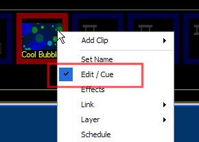

<h1>Customizing an effects clip</h1>
<ol 1"="" style="text-indent: 0px; margin-left: 0px; >: '<li ' value=;">
	
while the basic library effects can get you started, you may want 
	 to change the effect to customize it for your particular application. 
	 easy customizations you can make are:

</ol>
<ol>
	<li>
changing the color scheme and background color
</li>
	<li>
changing the effect speed
</li>
</ol>

if you want to make more complex changes to an effect, follow the steps 
 outlined in the <a href="WritingYourOwnEffectsScripts.md">creating 
 custom effects scripts</a> topic.

to begin customizing the effect, you must edit the clip.

right-click the effect clip and choose edit 
 / cue from the drop-down menu:

<ol>
	<li>The effect background can be set to any color desired or removed. 
	 (Removing the background color results in a transparent background).</li>
	<li>You may have to wait a few seconds after changing the color 
	 scheme before changes take effect. This is because color scheme changes 
	 only apply to new shapes, not shapes that are already on screen.</li>
</ol>
<h2>To make changes to the effect color scheme:</h2>
<ol>
	<li>Click the button corresponding to the scheme color you wish 
	 to change (1, 2, 3 or 4). To change the background color click the 
	 &quot;BG&quot; button. To turn off the background (make it transparent), 
	 click the &quot;Off&quot; button.</li>
	<li>Select the color from the pop-up dialog.</li>
	<li>The preview window updates automatically with the new color 
	 scheme, you may have to wait a few seconds.</li>
	<li>Click &quot;Apply Changes &gt;&gt;&gt;&quot; or close the Edit/Cue 
	 window to apply the changes to the effect.</li>
	<li>Customizing the effect speed</li>
	<li>The effect speed can be changed by altering the cycle time (also 
	 known as pulse time) of the effect. Longer cycle times mean that shapes 
	 have longer life-spans and the effect appears &quot;slower&quot;. 
	 Shorter cycle times make the effect quicker.</li>
	<li>Move the cycle time slider on the left of the Edit/Cue window 
	 until the desired speed is achieved.</li>
	<li>Click &quot;Apply Changes &gt;&gt;&gt;&quot; or close the Edit/Cue 
	 window to apply the changes to the effect.</li>
</ol>
