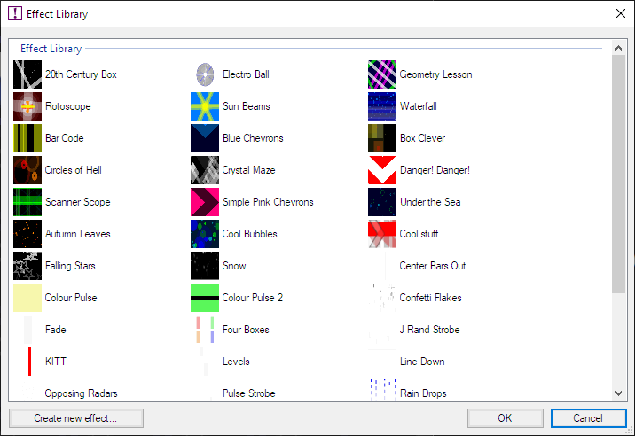
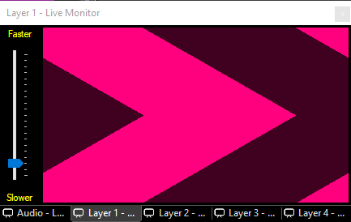

 
# Effects Generator Clip
The Effect Generator clip provides a way to generate simple moving patterns which have a variety of uses: for example to create a high-contrast moving backdrop for a stage show; creating cool moving effects for use in a night club; creating backgrounds for other Screen Monkey clip types that support transparency; or making simple, bright patterns that can be used to control a large LED screen.

When creating a new effects clip you have two choices:

- Choose an effect from the effect library. This is the quickest way to get up and running with effects, you can use one of the library effects as it is, or you can [customise](CustomizingAnEffectsClip.md) it.
    
- Create your own effect from scratch. If you're feeling adventurous you can [make your own effects](CreatingCustomEffects.md) using the simple scripting language. You can then add them to the library, allowing you to use them as a starting point for more effects, or reuse your effects in other Screen Monkey shows.  

## Create an Effects Generator Clip from Library
Click an empty dashboard slot and choose 'Effect Generator' from the new clip browser. You will then see the effect library.

Pick an effect to use and click OK. A new clip will be created with a thumbnail representing the effect. The clip may be assigned to any desired layer and may be assigned a transition.

## Use an Effects Generator Clip in a show
When presenting the live show, click the Effect Generator clip to play it. The animation speed can be adjusted by moving the slider at the left hand side of the Live Monitor.

## Configure an Effects Clip
You may customize existing effects from the library. First create a new clip as described above and then right-click the clip icon and choose 'Edit / Cue'. This will open the [Effect Editor](CustomizingAnEffectsClip.md).

