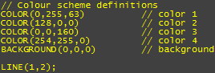

<h1>Scripting Language Reference</h1>
<h2>Effect Generator Scripting Reference</h2>

This section contains reference information for the Effect Generator 
 scripting language. For an introductory tutorial see the <a href="WritingYourOwnEffectsScripts.md">Creating 
 Your Own Effects Scripts</a> topic.

<h2>Syntax Overview</h2>

A brief outline of the general syntax for the scripting commands

Color scheme definitions

Color scheme definitions can appear anywhere 
 in your script, although convention is to put them at the start. Scheme 
 definitions are not indexed must appear in palette order. To change the 
 palette order change the order of the definitions.

Color scheme definition

	<table style="border-width: 0px; margin-left: 36px;" cellspacing="0">
		<tr class="hcp4">
			<td height="32" width="526" class="hcp5">
COLOR({red},{green},{blue});
</td>
		</tr>
	</table>

When defining Color scheme, the background 
 Color can be specified.

Background Color definition

	<table style="border-width: 0px; margin-left: 48px;" cellspacing="0">
		<tr class="hcp4">
			<td height="32" width="526" class="hcp5">
BACKGROUND({red},{green}{blue});
</td>
		</tr>
	</table>

The following is an example of a full Color 
 scheme definition block including all 4 palette Colors:

Example Color scheme definition

Shape definitions

Shape definitions consist of the shape name 
 and from 1 to 3 timing parameters. (The second and third timing parameters 
 are optional.)

Shape Timing definition

The Shape Timing definition consists of the 
 shape name and from 1 to 3 timing parameters.

(The second and third timing parameters are 
 optional.)

	<table style="border-width: 0px; margin-left: 60px;" cellspacing="0">
		<tr class="hcp4">
			<td height="32" width="526" class="hcp5">
{shapename}({pulsetime},{lifetime*},{delaytime*});
</td>
		</tr>
	</table>

&#160;

<table cellspacing="0" border="1" class="hcp9">
	<col>
	<col>
	<tr>
		<td>Pulse Time</td>
		<td>Defines the period (in cycles) between generation of new shapes.</td>
	</tr>
	<tr>
		<td>Life Time</td>
		<td>If omitted, is the same as pulse time. Otherwise, &#160;specifies 
		 the lifespan for each generated shape (in cycles).</td>
	</tr>
	<tr>
		<td>Delay Time</td>
		<td>Is the delay period (in cycles) before shapes begin to be generated, 
		 useful for offsetting shapes from each other (forcing them &quot;out 
		 of phase&quot; with one another).</td>
	</tr>
</table>

The following example shows a BOX shape with 
 a pulse time of 2 cycles and life span of 3 cycles and no delay:

	<table cellspacing="0" class="hcp10">
		<tr class="hcp4">
			<td height="32" width="526" class="hcp5">
BOX(2,3);
</td>
		</tr>
	</table>

&#160;

Shape Parameters

Shape parameters follow the shape definition. 
 There are 3 types of supported parameters and they can appear in any order 
 following the shape definition:

<ol>
	<li>
Color palette mappings 
	
</li>
</ol>

	<table cellspacing="0" class="hcp10">
		<tr class="hcp4">
			<td height="32" width="526" class="hcp5">
[{index},{opacity*},{tint*}];
</td>
		</tr>
	</table>

&#160;

<table cellspacing="0" border="1" class="hcp9">
	<col>
	<col>
	<tr>
		<td>Index</td>
		<td>Color palette number to use</td>
	</tr>
	<tr>
		<td>Opacity</td>
		<td>Optional transparency value from 0 (transparent) 
		 to 255 (opaque)</td>
	</tr>
	<tr>
		<td>Tint</td>
		<td>Optional darkness of the specified Color from 0 (black) to 
		 1 (full Color)</td>
	</tr>
</table>

&#160;

Each shape supports a number of mappable Color slots. Slot 1 and Slot 
 2 always correspond to the fill Color for the shape, and the border Color 
 for the shape respectively. Some shapes support more than one Color.

To map palette Colors to shape Color slots specify the Colors in order.

For example to map Color 2 to fill and Color 3 to border, use the following:

	<table cellspacing="0" class="hcp11">
		<tr class="hcp4">
			<td height="32" width="526" class="hcp5">
[2];[3];
</td>
		</tr>
	</table>

You may optionally specify opacity values for each Color mapping:

	<table cellspacing="0" class="hcp11">
		<tr class="hcp4">
			<td height="32" width="526" class="hcp5">
[2,128];[3,160];
</td>
		</tr>
	</table>

And tints if you require:

	<table cellspacing="0" class="hcp11">
		<tr class="hcp4">
			<td height="32" width="526" class="hcp5">
[2,128,0.5];[3,160,0.5];
</td>
		</tr>
	</table>

<ol>
	<li>Flags</li>
	<li>Flags are simple one-word parameters which change the shape's behaviour, 
	 there are currently two supported flag sets: fade and direction. To 
	 specify the flag just enter the flag name you want to use. The flag 
	 sets are as follows:</li>
</ol>
<ol>
	<li>Fade supports FADE, FADEIN and NONE. These correspond to fade from 
	 fully opaque to transparent during the shape's lifetime; the reverse 
	 effect, and no fade (fully opaque always).</li>
	<li>Direction supports UP, DOWN, LEFT and RIGHT. These correspond to 
	 directions of travel.</li>
</ol>

While it's possible to specify multiple flags from the same flag set, 
 this makes no sense as flags within a set are mutually exclusive. Specifying 
 LEFT and RIGHT flags together for example makes no sense.

<ol>
	<li>
Parameters
</li>
	<li>
Parameters are like flags except that they take a value as well, 
	 which affects how the shape behaves. Parameters are discusses in more 
	 detail in the shapes section below.
</li>
	<li>
Parameters always have the following form:
</li>
</ol>

Shape parameter syntax

	<table cellspacing="0" class="hcp11">
		<tr class="hcp4">
			<td height="32" width="526" class="hcp5">
{name}({value});
</td>
		</tr>
	</table>

Supported Shape Types

&#160;

<table cellspacing="0" border="1" class="hcp12">
	<col>
	<col>
	<tr>
		<td>
BLOCK
</td>
		<td>&#160;</td>
	</tr>
	<tr>
		<td>
BOX
</td>
		<td>Creates a box which appears at a random location and 
		 expands to a random size. Defaults to the fadein fade type. 
		 The maximum size may be overridden using the size parameter.</td>
	</tr>
	<tr>
		<td>
BUBBLE
</td>
		<td>Creates a bubble which appears at a random location along the 
		 bottom of the screen and rises to the top. The size is chosen 
		 at random but may be set to a fixed size using the size parameter 
		 or a minimum size specified using the min parameter.</td>
	</tr>
	<tr>
		<td>
CHEVRON
</td>
		<td>Creates a chevron which moves across the screen. The sweep 
		 parameter specifies the angle of the chevron as a percentage of 
		 the screen size.</td>
	</tr>
	<tr>
		<td>
CIRCLE
</td>
		<td>Creates a circle which appears at a random location and 
		 expands to a random size. Defaults to the fadein fade type. 
		 The maximum size may be overridden using the size parameter.</td>
	</tr>
	<tr>
		<td>
CONFETTI
</td>
		<td>&#160;</td>
	</tr>
	<tr>
		<td>
DIAMOND
</td>
		<td>Creates a diamond which appears at a random location 
		 and expands to a random size. Defaults to the fadein fade 
		 type. The maximum size may be overridden using the size parameter.</td>
	</tr>
	<tr>
		<td>
LEAF
</td>
		<td>Creates a leaf shape at a random location along the top 
		 of the screen which floats downward. Size is selected at random 
		 or may be overridden using the size or min 
		 parameters.</td>
	</tr>
	<tr>
		<td>
LINE
</td>
		<td>Creates a horizontal or vertical line that moves across the 
		 screen. The size of the line is selected at random or may be specified 
		 using the size parameter. The line begins at the 
		 screen edge.</td>
	</tr>
	<tr>
		<td>
LINEM
</td>
		<td>Creates a horizontal or vertical line that moves across the 
		 screen. The size of the line is selected at random or may be specified 
		 using the size parameter. The line begins in the 
		 middle of the screen.</td>
	</tr>
	<tr>
		<td>
RADAR
</td>
		<td>&#160;</td>
	</tr>
	<tr>
		<td>
ROTOR
</td>
		<td>&#160;</td>
	</tr>
	<tr>
		<td>
SNAKE
</td>
		<td>&#160;</td>
	</tr>
	<tr>
		<td>
SNOWFLAKE
</td>
		<td>Creates a snowflake shape at a random location along 
		 the top of the screen which floats downward. Size is selected 
		 at random or may be overridden using the size or 
		 min parameters.</td>
	</tr>
	<tr>
		<td>
STAR
</td>
		<td>Creates a star shape at a random location along the top 
		 of the screen which floats downward. Size is selected at random 
		 or may be overridden using the size or min 
		 parameters.</td>
	</tr>
	<tr>
		<td>
STROBE
</td>
		<td>&#160;</td>
	</tr>
	<tr>
		<td>
VUMETER
</td>
		<td>&#160;</td>
	</tr>
</table>

&#160;

Shape Parameters

Some parameters are supported by all shapes and some by only a few, 
 see the table below for which parameters are supported by which shapes. 
 The following is a description of each parameter and the values it will 
 accept.

<table cellspacing="0" border="1" class="hcp12">
	<col>
	<col>
	<col>
	<tr>
		<td bgcolor="#808080">Parameter</td>
		<td bgcolor="#808080">Range/Values</td>
		<td bgcolor="#808080">Description</td>
	</tr>
	<tr>
		<td>size()</td>
		<td>percentage</td>
		<td>Sets the maximum (or fixed) size for a shape. Specified as 
		 a percentage of the screen size, can exceed 100% if you want a 
		 large shape.</td>
	</tr>
	<tr>
		<td colspan="3" bgcolor="#C0C0C0">Example: 
		 SIZE(50); 
		
Note: do not include the % sign!

		
&#160;
</td>
		
	</tr>
	<tr>
		<td>border()</td>
		<td>pixels</td>
		<td>Sets the border width for the shape. Specified in pixels.</td>
	</tr>
	<tr>
		<td colspan="3" bgcolor="#C0C0C0">Example: 
		 BORDER(4); 
		 &#160;</td>
		
	</tr>
	<tr>
		<td>min()</td>
		<td>percentage</td>
		<td>Sets the minimum size for a shape which supports random size 
		 such as BUBBLE and CIRCLE.</td>
	</tr>
	<tr>
		<td colspan="3" bgcolor="#C0C0C0">Example:&#160;MIN(10); 
		 
		 &#160; 
		
Note: min should be less than size!

		
&#160;
</td>
		
	</tr>
	<tr>
		<td>sweep()</td>
		<td>percentage</td>
		<td>Sets the sweep angle for the CHEVRON shape.</td>
	</tr>
	<tr>
		<td colspan="3" bgcolor="#C0C0C0">Example:&#160;SWEEP(50); 
		 
		 &#160;</td>
		
	</tr>
	<tr>
		<td>&#160;</td>
		<td>&#160;</td>
		<td>&#160;</td>
	</tr>
</table>

&#160;

Shape Parameter Support and Color Slot Mapping Table

The following table summarizes the parameters and flags supported by 
 each shape.

