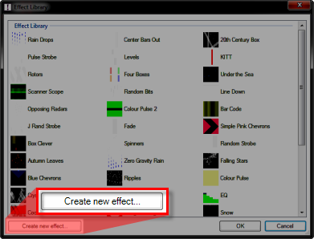
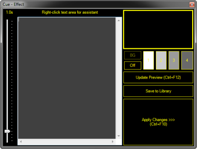
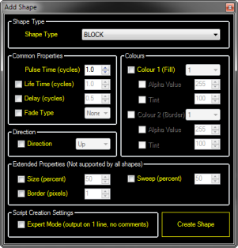
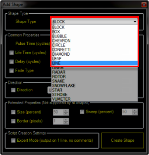
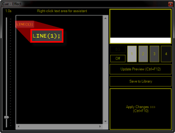
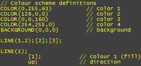
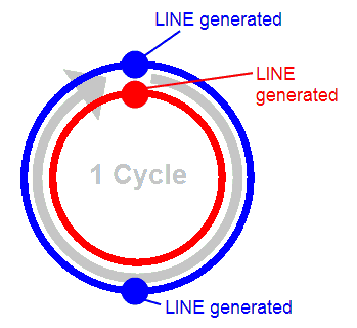

# Writing Your Own Effects Scripts

This topic explains the concepts relating to the **Effect Generator** clip type, and how to create your own effects scripts. For information on creating and getting started with effects clips themselves check out the [Writing your own Effects Scripts](WritingYourOwnEffectsScripts.md) topic. For reference information on the effect generator scripting language take a look at the [Scripting Language Reference](ScriptingLanguageReference.md).

## How the Effects Generator works

Effects consist of 3 parts:

1.  A list of **shapes** which make up the effect.
    
2.  A **color scheme** which determines what colors the shapes will be.
    
3.  A **cycle time** which determines how quickly new shapes are created and how long they last for.
    

We will look at how these three things are combined to make an effect in this section.

1.  Shapes  
      
    Shapes are the building blocks you will use to create effects. Each shape supports different parameters which allow its appearance and behavior to be customized. A full list of shapes and the parameters supported by each is available in the [language reference](ScriptingLanguageReference.md).
    
2.  Color Scheme  
      
    Up to four colors may be used for shapes in your effect as well as an optional additional background color (specifying no background color makes the background transparent). Each shape uses one or more of the scheme colors, and may optionally be configured with a **tint** (darkness) and **opacity** for the color.
    
3.  Cycle Time  
      
    When a shape is added to an effect, you must choose how often the shape should be generated. This value is specified in **cycles**.  
      
    For example, specifying a shape generation interval of 1 cycle means that 1 shape will be generated for each cycle. But what exactly is a cycle?  
      
    A cycle is an arbitrary length of time which you may adjust in order to make your effect play faster or slower: By specifying all the shape intervals in terms of cycles it's easy to make the effect faster (by specifying a shorter cycle time) or slower (by specifying a longer one).
    

## Creating a New Effect

Writing effect scripts can be tricky at first. Fortunately the editor includes a useful feature called the **assistant** which allows quick creation of script entries. You may then customize the generated script by editing it.

1.  To Create a New Effect, right-click an empty slot and choose the Effect Generator Clip type.  
      
    The Effect Library dialog opens.
    
2.  Click the Create New Effect button in the lower left corner of the dialog.  
      
      
      
    The Cue - Effect dialog opens.  
      
    
    

Using the Assistant

To access the assistant, right-click the large gray area in the left side of the dialog.

The Add Shape dialog opens.

Each feature has a check box which allows you to decide whether you want the feature enabled or not. If you don't specify a feature it will keep its default value.

We will add a **LINE** shape to our effect:

1.  Click the shape type drop-down and select **LINE** from the list.  
      
    
    
2.  Click **Create Shape.**  
      
    (Create Shape is the yellow box in the lower right corner of the dialog.)  
      
    The preview window should now show a horizontal line moving from top to bottom. Notice that each line has a random height, and one line is being generated each second. (this is because the cycle time is 1 second by default). At this point your script looks like this:  
      
      
      
    This tells the effect to generate a LINE every 1 cycles, this is called the **pulse time**. Since the shape will by default have a **life time** that matches its **pulse time**, a new LINE is generated each time the old one dies.
    
3.  We may also specify a different **life time** to the **pulse time**, the **life time** is specified by entering it after the **pulse time**, separated by a comma. Change the script to read:  
      
    LINE (1,2);  
      
    Click **Update Preview and observe the preview window** to see the results of this change.  
      
    We now see two lines on screen at the same time because one new LINE is being generated each cycle, and each LINE lives for two cycles.
    

  

All shapes support **pulse time** and **life time**, combining these two settings allows you to control the speed of generated shapes, and the number of shapes on the screen at once.

## Creating a color scheme

Creating a color scheme for your effect is as simple as clicking the numbered palette buttons and choosing a color. Do this now by clicking each palette button in turn and choosing a color.

Notice that our color scheme definition has now been added to the script, you may change these numbers if you like, or you may simply use the palette buttons to update them at any time.

The color scheme definitions look like the this (note that the numbers will be different depending on the colors you selected:

The color scheme may be placed anywhere you choose within the script.

  

**Note that for consistency with other scripting languages, the American spelling of "color" is used for color scheme definitions.**

## **Assigning colors to shapes**

You may have noticed that when you changed color scheme entry number 1, the LINE shape we have already added to our scene changed color to match, this is because by default all shapes use color index 1. So how do we assign a different color to a shape? It's easy!

Shapes may be configured with up to 3 colors. (see the table in the [language reference](ScriptingLanguageReference.md) for details)

For all shapes, the first two colors are the **fill color** and the **border color**. To change the color assignments we enter the colors to use in order, enclosed in square brackets and separated with semicolons.

For example, to use color 2 for **fill color** and color 3 and **border color** we would need to add:

\[2\];\[3\];

Add this to your script now, you should have the following:

Click **Update Preview** to see your changes.

  

Be certain to avoid using spaces. all the characters need to be one after the other.

Now wait a minute? Why did the border of the LINEs not change color?

This is because the default border thickness is zero. We will look at how to fix this by assigning border and other parameters later.

## Adding more shapes to the effect

While it's possible to create a nice effect using a single shape, more often we will want to add more shapes to the effect.

Lets add another shape to the effect using the assistant:

1.  Right click the script area to show the assistant.
    
2.  Choose **LINE** from the drop-down.
    
3.  Click the **Direction** check box and select **Up** from the drop-down.
    
4.  Click the **Colour 1 (Fill)** check box and select **1** in the drop-down.
    
5.  Click **Create Shape**.
    

If all goes to plan you should now have a line traveling up the screen for every two that travel down. Notice that the lines going up and the lines going down are in sync.

Our script so far looks like this:

Wait a minute! Why is the **up** parameter on a line of its own? And what does "**// direction**" mean?

The answer is it's okay to split your shape definitions onto separate lines, but with one rule: **each line which forms part of the shape definitions MUST end with a semicolon!**

This means that:

LINE (1,2);\[2\];\[3\];

is the same as

LINE (1,2);

\[2\];

\[3\];

But the lines below will **NOT** work as expected as they break the rule.

LINE (1,2);

\[2\] <=== Note that the semicolon is missing

\[3\];

As for the "**// direction**" part, this is known as a "comment" and it's a way of leaving notes in a script that provide helpful information. In this case describing the parameter to the left of it.

You might notice the comments in the color scheme definition. These help identify which color is which. You can learn more about comments in the [language reference.](ScriptingLanguageReference.md)

## Spicing things up - using **_delay time_**

What we have so far is very nice, but the lines are perfectly in sync: each upward line is generated perfectly in time with every other, this is because both are generated at the same time in the cycle, this is represented as follows:

The outer (blue) line represents the first LINE shape, which is generated twice per cycle. The inner (red) track represents the second LINE shape. Notice that the first and second lines are generated at the same point in the cycle. While sometimes this is desirable, other times we may want to make the effect more interesting or make it look more natural by offsetting shape generation.

This is achieved using a third time parameter when specifying the shape, this is added after the **life time** parameter and is known as **delay time**.

We will delay our second LINE shape by quarter of a cycle in order to bring it out of sync with the other line object, we will leave the **life time** as 1 cycle. Change your script to include the new parameter, you should have:

  

LINE(1,2);\[2\];\[3\];

  

LINE(1,1,0.25);

 up;            // direction

Press **Update Preview** to see your changes, the end result is a system which can be represented as follows:

6\. Using color tints and opacity

As mentioned above, when assigning colors to shapes, you can also choose a tint and an opacity value, we have already seen how to specify colors by palette number:

\[_<number>_\]                    example: \[1\]

However, it is also possible to specify an opacity from 0 to 255 where 0 is transparent and 255 is fully opaque:

\[_<number>,_<opacity>\]          example: \[1,128\]

You can also specify a "tint value" from 0 to 1 where 0 is black and 1 is full color:

\[_<number>,_<opacity>,<tint>\]   example:   \[1,128,0.5\]

Let's try it out by assigning a partially transparent color to the upward lines. Add the following at the end of the script:

\[4,120\];

You should now have:

LINE(1,2);\[2\];\[3\];

color: #ffff00;">LINE(1,1,0.25);

        up;            // direction

        \[4,120\];

Click **Update Preview** to apply the changes, you should now notice that the upward lines are partially see-through, and when they pass over the downward lines the colors are blended.

Digging Deeper - Customising Shapes Using Parameters

Whilst using different shapes allows you to create cool effects, you can also take control of how your shapes behave by using **parameters**. We have already seen an example of a parameter that changes a shape's behaviour above - that is the _direction_ parameter we used to make the LINE move up instead of down.

Before we get started, it helps to know a couple of things about parameters:

All shape parameters have a **default value**. This is the value that the shape will assume if the parameter is not specified.p>

Parameters come in two flavors, **flags** and **parameters**

     **Flags** are kind of like a selector switch for your shape that alter the behaviour in some way, the _direction_ flag is a good example of a **flag** parameter. **Flags** are specified by simply putting the name of the flag you want to use. For example UP, DOWN, LEFT or RIGHT for the _direction_ flag.  

Here is an example of a flag:/p>

            LEFT;

     Parameters are used to control a value and consist of a parameter name and a value in brackets. The _size_ parameter for example specifies the size of a shape in percentage points:

      SIZE(50);

This tells the shape's size to be 50% of the screen size.

A full list of parameters is available in the [language reference](ScriptingLanguageReference.md).

1\. Using the assistant to set initial parameters

To make it easy to experiment and see how different parameters affect different shapes, you can use the assistant to generate parameters for you, and then simply change the values.

Have fun making your own effects!