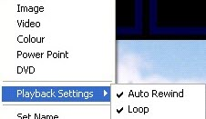

<h1> 
 Flash Clip</h1>
<h2>What a Flash Clip does</h2>

The Flash Clip allows you to display flash animations and presentations 
 as you would any other clip.

&#160;

<h2>How to configure a Flash Clip</h2>

To add a flash SWF file, right-click or click an empty clip panel and 
 select Flash. Find the flash file 
 you want to add and click OK. 
 The flash clip will be added and you will see a preview in the control 
 panel. You may also click and drag the flash file directly onto an empty 
 clip panel.

<table style="margin-left: 12px; border-collapse: separate; border-collapse: separate;" 
		 cellspacing="0" border="1">
	<col>
	<col>
	<tr>
		<td></td>
		<td>If you are using Screen Monkey on a&#160;64 bit variety of 
		 Windows 7, the Flash Clip will be available and allow you to choose 
		 a file, but will not present the Flash Clip when you try to play 
		 it.</td>
	</tr>
</table>

&#160;

<h2>How to use a Flash Clip during a show</h2>

When presenting a show, you click the clip inside Screen Monkey to begin 
 playing it. Clicking the clip again will pause playback. 

If the clip is one that simply plays through, you may wish to use the 
 <a href="../../tutorials/WorkingWithShows/LiveMonitor.md">Live Monitor</a> 
 in order to see other playback controls as well as keep an eye on elapsed 
 time and time remaining. Otherwise, the Live Monitor will allow you to 
 interact with the Flash clip.

When running a flash show there are a couple of options 
 you can set to determine how the show is run.

<table style="margin-left: 24px;" cellspacing="0" border="1">
	<col>
	<col>
	<tr>
		<td class="hcp4">Auto 
		 Rewind</td>
		<td class="hcp4">When this option is selected the 
		 flash show will always start from the beginning whenever you play 
		 the clip. If you de-select this option the flash show will be 
		 played from where it left off when you next run the clip. If this 
		 option is selected and you want to force the clip to play from 
		 the start then you can hold down Ctrl 
		 while running the clip to start the flash show at the start.</td>
	</tr>
	<tr>
		<td class="hcp4">Loop</td>
		<td class="hcp4">With loop selected the flash show 
		 will start again from the beginning when the end of the show is 
		 reached. If this is not selected then the show will stop at the 
		 end.</td>
	</tr>
</table>

&#160;

<h2 class="rvps3">Enhancement History</h2>

<a href="../../releases/Version_2.md#SWFSupport">Version 2 - 4th May 
 2006: ShockWave Flash Support Added</a>

<a href="../../releases/Version_3.md#FlashNotInstalled">Version 3 
 - 4th September 2007: Flash Not Installed</a>

<a href="../../releases/Version_3.md#VistaCompatibility">Version 3 
 - 27th August 2007: Vista Compatibility</a>

<a href="../../releases/Version_3.md#ClipRewind">Version 3 - 7th November 
 2007: Clip Rewind</a>

<a href="../../releases/Version_3_1.md#Flash_Hotkey_Inject">Version 
 3.1 - 24th May 2008: Flash Hotkey Inject</a>

<a href="../../releases/Version_3_2.md#FlashClipLink">Version 3.2 
 - 13th October 2008: Flash clip link</a>

