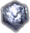

 
# Freeze Clip

The Freeze Clip allows you to take a frozen snapshot of whatever is on the screen. For example, suppose a [Video Clip](VideoClip.md) is playing. Clicking the Freeze Clip captures whatever is on the screen and keeps the image visible. This may be desired if you want to essentially pause playback of the Video Clip to examine some aspect of it and perhaps use the [Scribble Clip](ScribbleClip.md) to draw on it.

## Configure a Freeze Clip
When a Freeze clip is added it simply appears in the Screen Monkey Dashboard. Aside from adding a Transition Effect or assigning it to a specific layer, there are no configuration options.

## Use a Freeze Clip in a show
Perhaps you are playing a Video Clip on Layer 2 and you have assigned the Freeze Clip to Layer 3. You click the Freeze clip and it captures whatever the Video Clip was playing and presents it as a static image on Layer 3. Layer 2 will continue playing along but will not be seen as the Freeze is on Layer 3 and is covering Layer 2.

Or perhaps the reverse is true. You are playing a Video Clip on Layer 3 and you have assigned the Freeze Clip to Layer 2. You click the Freeze Clip and it captures whatever the Video Clip was playing and presents it as a static image on Layer 2. After the Video Clip completes or you fade it out, the static image then appears on Layer 2.