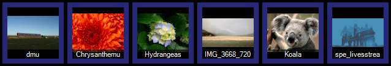

 
# Image Clip

The Image Clip allows you to display a static image from a file on the screen. Any supported image type will be displayed. You may wish to display some graphics or a photo. For example, perhaps you are presenting to a church audience and you know the minister will refer to a certain book during the sermon. You might superimpose an image of the book being discussed so the congregation might more easily find it in the bookstore after service.

Image Clips do not need to be full screen so are also a great way to create lower thirds or logos.

## Create an Image Clip
Click on an empty dashboard slot and choose the Image clip type from the create clip dialog. When you add an image clip you are presented with a file browse dialog that allows you to navigate to and choose the image. After selecting the image file it is added to the slot and the thumbnail updates to show the image in the file.

To quickly add a large number of images you can also drag-drog from Windows Explorer onto the dashboard or use the [Open File](../CreatingClips.md) feature of the create clip dialog.

## Configure an Image Clip
If the image has the same dimensions as the output resolution of your system then no confiuguration is required. 

However if the image is a different size and/or aspect radio then you may need to tell Screen Monkey how you want the image to be presented.

Right click on the image thumbnail in the dashboard and choose 'Display Options'

There are two parts to the display style settings.

### Image Resizing
There are three different resizing options available.

|Setting|Description|
|-|-|
|Stretch to Fill Screen|Your image will be stretched either vertically or horizontally until it reaches the edges of the screen.|
|Zoom|The image will be enlarged until it reaches all edges of the screen. Some cropping may occur.|
|Letterbox/Pillarbox|The orginal aspect ratio will be preserved and empty space will be created. Depending on the size of the original image it may be scaled to fill either the horizontal or vertical space. The remaining empty space is configured using the 'Background' optoins.|

### Background
If you choose 'Letterbox / Pillarbox' empty space is created. Choose what is put into this space from the options below.

|Setting|Description|
|-|-|
|Transparent|All lower layers are visible. If the image is on layer 1 then the Windows desktop is visible.|
|Solid Black|Black.|
|Echo|A stretched, blurred version of the original image.|

### Apply Settings
These buttons allow you to make apply the changes.

- **Apply to All** Make the change to all images in the current show.
- **Apply** Make the change to this image. If the clip is live the changes will be made immediately.
- **OK** Make the change to this image and close the dialog.
- **Cancel** Make no changes and close the dialog.

You can also configure the options for all new image clips.

- **Load Default Style** Apply the default set of options previously saved for this show
- **Set As Default Style** Save the current set of options as defaults and use them for all new image clips in this show. 

## Use an Image Clip in a show
Presenting images is just like presenting other clip types. You click the image and it shows on the screen until you either fade it out of view or clear the layer it is being presented on.

Image clips can be configured with links, effects, transitions, scheudules etc. as described in [Clip Settings](../clipSettings/clipSettings.md).

*Note:* Some image types (such as .GIF) support animation. If you use a .GIF image type and it is animated Screen Monkey will only render a static image and the animation will not occur.
