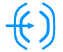
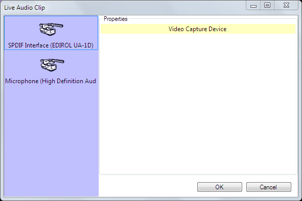

 
# Live Audio Clip

The Live Audio clip allows you to connect to a live audio feed. You can use this clip to play audio from any physical sound input connected to your computer. This is useful if you want to automatically switch between live and pre-recorded content or you want to mix live audio with content from Screen Monkey.

## Create a Live Audio Clip
Before this clip can be used you must have some form of live audio feed connected to the computer. This can be plugged directly into the audio line in socket or through a USB-Audio interface.

Adding the Live Audio clip is the same as adding any other clip type. Click on an empty dashboard slot and choose Live Audio. The Live Audio Clip dialog will appear.

Click to select the device you wish to use and additional options may become available. Once you have configured any required settings click OK and the Live Audio clip will be added to the dashboard. The Live Audio clip will play on the audio layer.

*Note:* The dialog will show the actual device(s) connected to your computer. The example above shows two devices but yours may be very different depending on your setup.

## Use a Live Audio Clip in a show
Using the Live Audio clip is as simple as clicking the icon. Click the icon on the dashboard and the Live Audio feed will be played. You can fade a Live Audio feed in and out as needed using the [Layers Dashboard](../toolbar/layers.md).

