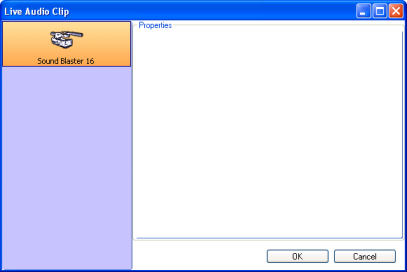

 
# Live Audio Clip

## What a Live Audio Clip does

The Live Audio clip allows you to connect to a live audio feed. You can use this clip to play audio from any sound card input. This is useful if you want to automatically switch between live and pre-recorded content or you want to mix live audio with content from Screen Monkey.

## How to configure a Live Audio Clip

  

Before this clip type will work, you must have some form of live audio feed connected to the computer. This may mean you need to acquire and install additional hardware and software. Usually in the form of a sound card or USB device.

Adding the Live Audio clip is the same as adding any other clip type. Either click or right-click an empty slot and choose Live Audio.

The Live Audio Clip dialog should display.

Note that what this dialog will present will depend entirely on the device(s) connected to your computer. The example above lists one device. But yours may have only one, more than one or possibly none, depending on whether you have a device actually connected or not.

Assuming you have a device connected, click to choose it and the other options may become available.

Once you have configured things, click OK and the Live Audio clip should be added to the Main Dashboard.

## How to use a Live Audio Clip during a show

Using the Live Audio is as simple as clicking the icon. You click the icon and the Live Audio feed should initialize and appear. You may wish to fade a Live Audio feed in and out as needed using the [Layers Dashboard](../../tutorials/WorkingWithShows/LayersDashboard.md).

