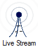
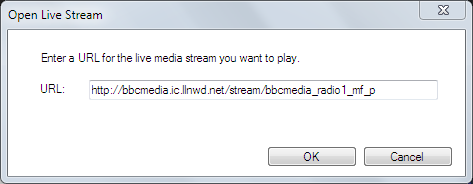

# Live Stream Clip

The Live Stream clip can be used to display live video and audio streams from local or internet servers.

## Create a Live Stream Clip
Adding the Live Stream clip is the same as adding any other clip type. Click an empty slot and choose Live Stream from the new clip browser.

The Open Live Stream dialog is presented.

Type or paste the URL for the Live Stream into the field and click OK. A new clip icon will appear on the dashboard.

## Use a Live Stream Clip in a show
Using this Clip type is just like any other. You click the clip to start playing it.

