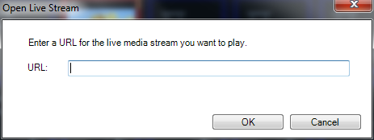

<h1>Live Stream Clip</h1>
<h2>What a Live Stream Clip does</h2>

The Live Stream clip is used when you want to display 
 live video streams across the internet. 

&#160;

<h2>How to configure a Live Stream Clip</h2>

Adding the Live Stream clip is the same as adding any other clip type. 
 Either click or right-click an empty slot and choose Live 
 Stream.

The Open Live Stream dialog 
 is presented.

Type the URL for the Live Stream into the field and click OK.

<h2 class="rvps3">&#160;</h2>
<h2 class="rvps3">How to use a Live Stream Clip during a show</h2>

Using this Clip type is just like any other. You click the clip to display 
 it.

&#160;

<h2 class="rvps3">Enhancement History</h2>

<a href="../../releases/Version_3_7.md#LiveStreamClip">Version 3.7 
 - July 2012: Live Stream Clip announced and added</a>

