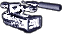
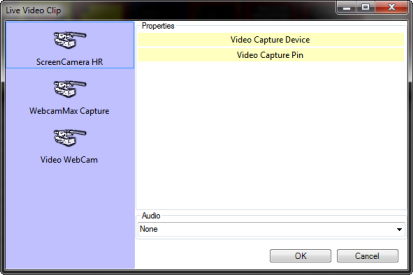
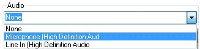
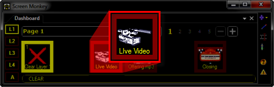

 
# Live Video Clip

The Live Video clip allows you to present a live video feed. The live video may be obtained from any connected camera, web cam or capture card and will be displayed directly on the screen. You can use this clip to seamlessly and smoothly switch between static graphics and live video. Screen Monkey works with most video capture cards and live video interfaces.

## How to configure a Live Video Clip

Before this clip type will work, you must have some form of live video feed connected to the computer. This often means you need to acquire and install additional hardware and software. Usually in the form of a video capture card or USB device. Common devices are the [ViewCast Osprey](http://www.viewcast.com/products/osprey-cards) (installed in a desktop computer) and the [K-World USB](http://us.kworld-global.com/main/prod_in.aspx?mnuid=1306&modid=10&prodid=104&flag=1) (connects to USB ports and may be used with Desktop or Laptop computers). You must also install the drivers the device will need.  
   
[Click here](http://www.google.com/search?q=video+capture+card) to open a new window that will search Google for Video Capture cards.

Adding the Live Video clip is the same as adding any other clip type. Either click or right-click an empty slot and choose Live Video.

The Live Video Clip dialog should display.

Note that what this dialog will present will depend entirely on the device(s) connected to your computer. The example above lists three devices. But yours may have only one, more than one or possibly none, depending on whether you have a device actually connected or not.

Assuming you have a device connected, click to choose it and the other options should then become available.

  

Often the settings include a buffer size. The buffer is used to store video frames while the computer processes them. This prevents frames from being dropped when you are capturing to a file. However, when displaying live this buffer may cause a delay which is more noticeable than dropping frames. It is recommended that you reduce the buffer size to the minimum to get the best performance from your capture device.

Note that you may also choose an Audio device.

In many setups it won't be necessary to choose Audio. This is because in many environments audio is handled separately through a separate sound system with many microphones and a multiple channel mixing board. However, in some circumstances such as TV, it may be helpful to link the video to an audio input so the audio fades with the video. This is done by selecting the audio input from the drop down list.

Once you have configured things, click OK and the Live Video clip should be added to the Main Dashboard.

Note that the image above depicts the words "Live Video" below the camera. This is because after adding the clip, it was right-clicked and Renamed to those words. Otherwise it would show whatever the device name was that you selected in the dialog.

## How to use a Live Video Clip during a show

Using the Live Video is as simple as clicking the icon. You click the icon and the Live Video feed should initialize and appear. You may wish to fade a Live Video feed in and out as needed using the [Layers Dashboard](../../tutorials/WorkingWithShows/LayersDashboard.md).
