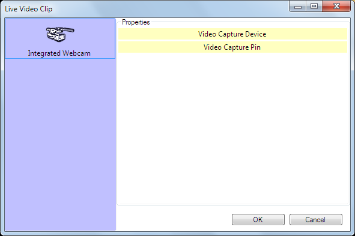

 
# Live Video Snapshot Clip

This clip type allows you to quickly and easily grab a freeze frame image from live video input. It is similar to the still store function on a hardware vision mixer. The stills grabbed can then be displayed using Screen Monkey.

You can create as many Live Video Snapshot clips as you need, each with a different still image.

## Create a Live Video Snapshot Clip
Click an empty dashboard slot and choose Live Video Snapshot from the new clip browser. The Live Video Clip dialog will appear.

*Note:* The list of devices shown will depend on the physical hardware available on your computer.

Click to choose the device you wish to capture on the left side of the dialog, then click OK. A new clip containing the current frame at the point you clicked OK will appear on the dashboard.

## Use a Live Video Snapshot Clip in a show
Once the frame has been grabbed the clip will behave like an [image](ImageClip.md) clip.