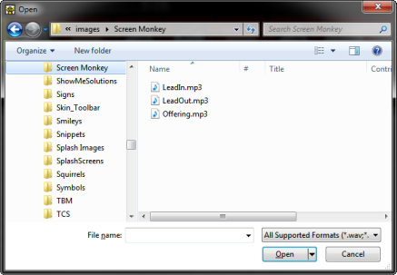
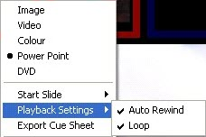

 
# PowerPoint Clip

PowerPoint is a Microsoft product for creating presentations. Many organizations have no knowledge of Screen Monkey and use PowerPoint alone to present content.

The PowerPoint Clip allows you to Load and run a PowerPoint presentation directly from ScreenMonkey. When using this clip type you have full control of the presentation including the ability to advance the slide.

# Configure a PowerPoint Clip

When you click a slot and choose to add a PowerPoint clip, you are presented with a file browsing dialog from which you may browse the PC file system and select the PowerPoint presentation you wish to use.

It may take some time for the clip to load depending on the size of the presentation. While it is loading a loading animation will be displayed in the panel. Once the presentation has loaded you will see a thumbnail image of the first slide in the presentation.

After the clip has been created you may apply a [Transition](../../tutorials/WorkingWithClips/Transitions.md) or [Effect](../../tutorials/WorkingWithClips/Effects.md) to it.

You may wish to begin the presentation at a different slide number than the first slide. To accomplish this, right-click the clip and choose Start Slide > Slide N (where N represents the slide number you wish to present.)

## Use a PowerPoint Clip in a show

Like other clips, you click once on the clip to begin presenting.

When running PowerPoint there are a number of options you can change to determine how the presentation runs.

Auto Rewind

Normally when you move to another clip or clear the screen the presentation is rewound back to slide 1. However if you turn Auto Rewind off under the PowerPoint Playback Settings then the presentation will be run from the slide being viewed when the clip was last stopped. If you need to force the clip to start from the first slide then when playing the clip hold down the Ctrl key. This will then rewind the presentation to the start and play the clip.

Loop

With this set the presentation will loop back to the first slide when it reaches the last slide. This option can be set in PowerPoint and if set will be shown as such in Screen Monkey. However you can override this setting by selecting loop and toggle whether the presentation is looped or not.

Because PowerPoint contains different slides, you need an ability to navigate from slide to slide.

Next and Previous Slides

When the PowerPoint clip is playing each click on the clip in Screen Monkey will advance the PowerPoint presentation. Exactly how the presentation is advanced depends on how it was created. For example, many presentations are created with Bullet Point builds where bullet points are presented one after another on mouse clicks.

If you want to go back to a previous slide, press and hold the shift key while clicking on the clip.

Going to a specific Slide

Screen Monkey allows you to configure things so that when playing a PowerPoint presentation you are able to type a slide number and press a key to present that slide number during playback.

For this feature to work you must first assign a terminating key which will indicate you have finished entering the slide number and wish to jump to the slide. The terminating key is configured in the [mouse and keyboard settings](../Setup/Settings/MouseandKeyboard.md).

Using a Remote Control

Often folks will acquire a Remote Control that is used for advancing PowerPoint. [Click here](../../tutorials/WorkingWithShows/UseARemotePointerWithPowerPoint.md) for more information on configuring Screen Monkey to work with these devices.

  

Sometimes there are reasons for using PowerPoint separately from Screen Monkey. For example, you may be able to gain an additional layer by presenting the PowerPoint using PowerPoint and using Screen Monkey to provide the four layers that would cover the PowerPoint show.  
   
You may find that when using PowerPoint that there are some icons that appear in the lower left corner of the presentation.  
   
  
   
These are turned off in PowerPoint by editing the options.  
PowerPoint 2003 - Tools > Options > View > Clear the Show popup toolbar  
PowerPoint 2007 - Office Button > PowerPoint Options > Advanced > Slide Show > Show popup toolbar  
PowerPoint 2010 - File tab > Options > Advanced > Slide Show > Show popup toolbar  
   
Additionally, if you are running PowerPoint separately from Screen Monkey, you may find the OfficeOne PowerShow add in helpful. PowerShow allows a PowerPoint presentation to play even when focus moves away from PowerPoint. (as it will when you go interact with Screen Monkey)  
   
[Click here](http://officeone.mvps.org/powershow/powershow.html) to visit the OfficeOne PowerShow site  
   
Lastly, if you use PowerPoint in the Presenter view, you may wish to size the Presenter view so you see both Screen Monkey and the PowerPoint presenter at the same time. For this, you may find that installing and using a freeware application called Sizer is useful. Sizer allows you to easily snap a window to a pre-determined size and screen position.  
   
[Click here](http://www.brianapps.net/sizer/) to visit the Sizer site

The live monitor for a PowerPoint slide presents images of the Previous, Current and Next slides. It shows the slide in its completed form once all the animations have run. !\[\](../../images/img\_292.jpg)

The live monitor for a PowerPoint slide presents images of the Previous, Current and Next slides. It shows the slide in its completed form once all the animations have run. !\[\](../../images/img\_292.jpg)