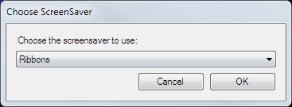

 
# Screen Saver Clip

The Screen Saver clip allows you to use any of the installed Windows screensavers as clips in Screen Monkey.

## Configure a Screen Saver Clip
When you choose to add the screen saver clip Screen Monkey will ask you to choose from one of the installed screen savers.

You can also add a screen saver clip by dragging a .SCR file from Windows Explorer onto a clip panel. If you add additional screen saver files using the .SCR format, they are added to the list presented by Screen Monkey.

Some savers have additional options, (such as the Text used for the 3D Text screensaver). Right-click the clip and choose 'Configure Screensaver' to see these options.

## Use a Screen Saver Clip in a show
This clip is like any other. Left-click to activate it. 

Screen Monkey renders the screensaver on the monitor configured in your [display profile](../toolbar/display.md). Unlike the normal Windows screensaver mouse movements don't cause the screensaver to be dismissed. To stop a running screen saver use the 'Clear Layer' clip as normal.
