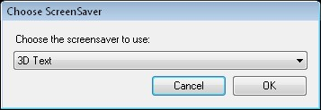

<h1> 
 Screen Saver Clip</h1>
<h2>What a Screen Saver Clip does</h2>

The Screen Saver clip allows you to play any of the installed Windows 
 screen savers within Screen Monkey.

&#160;

<h2>How to configure a Screen Saver Clip</h2>

When you choose to add the screen saver clip Screen Monkey will ask 
 you to choose from one of the installed screen savers.

You can also add a screen saver clip by dragging a .SCR 
 file from Windows Explorer onto a clip panel. If you add additional screen 
 saver files using the .SCR format, they are added to the list presented 
 by Screen Monkey.

To configure any Screen Saver options, (such as the Text used for the 
 3D Text screen saver) right-click the clip and choose Configure 
 Screensaver.

&#160;

<h2>How to use a Screen Saver Clip during a show</h2>

This clip is like any other. You click it to run it. The main difference 
 is that when launching a Screen Saver in Windows, it covers the main display 
 and any computer activity such as moving the mouse or touching the keyboard 
 immediately dismisses the screen saver.

Screen Monkey causes the screen saver to only display on the second 
 monitor or connected display device. Additionally, mouse movements don't 
 cause the screen saver to be dismissed. If you wish to dismiss the running 
 screen saver, you must Clear the layer playing it.

&#160;

<h2 class="rvps3">Enhancement History</h2>

<a href="../../releases/Version_3_3.md#ScreenSaver">Version 3.3 - 
 22nd October 2009: Screen Saver Clip Added and announced</a>

