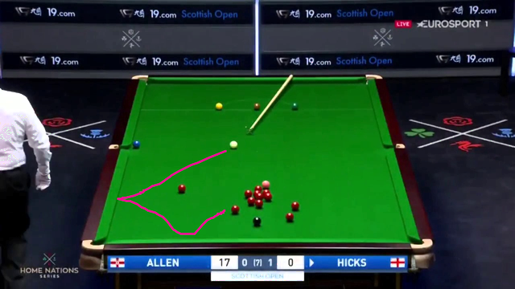
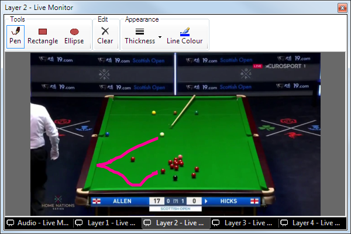

# Scribble Clip

The scribble clip allows you to freehand draw on the screen using a mouse or trackpad. The drawing is overlaid on top of any video or media playing on other lower layers. There are a number of applications for this clip, such as in classrooms where the teacher want to highlight a specific part of a video or during live sport commentary where the commentators want to point out a specific part of a replay.

## Create a Scribble Clip
To add a Scribble Clip, click an empty slot and choose Scribble from the create clip dialog. Ensure the Scribble clip is manually [assigned to a layer](../clipSettings/layer.md) that sits above (higher layer number) your video or whatever clip you will be annotating. To make running the show easier the Scribble clip should not be set to 'Active Layer'.

## Use a Scribble Clip in a show
To begin drawing click the Scribble clip to play it. Initially the drawing canvas is empty so there will be no visible change to the output. You must also open the [live monitor](../toolbar/preview.md) for the layer on which the Scribble clip is assigned to access the controls. 

In this example the Snooker video clip is on layer 1 and the Scribble clip is on layer 2. Note the layer 2 live monitor is selected.

The live monitor for the Scribble clip contains a canvas for drawing and a toolstrip of pens, shapes, and options for line thickness and line colour. As soon as you start to draw the output will update. You may use the Clear button to remove all your doodles and start over.

When using the Scribble clip you may also want to use the [Freeze](FreezeClip.md) or [Live Video Snapshot](LiveVideoSnapshotClip.md) clip. Or you may find it simpler to just pause the video if playing back [Video](VideoClip.md) or [DVD](DVDClip.md).
