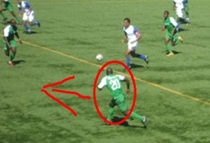
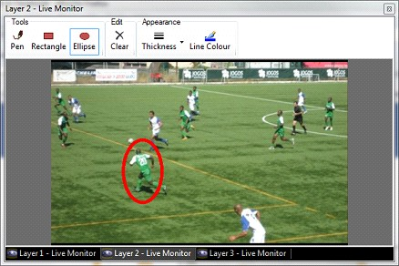

<h1>Scribble Clip</h1>
<h2>What a Scribble Clip does</h2>

The scribble clip allows you to freehand draw on the screen. The drawing 
 is overlaid on top of any video or media playing on other layers. There 
 are a number of applications for this, such as in classrooms where the 
 teacher want to highlight a specific part of a video or during live commentary 
 where the commentators want to point out a specific part of a replay.

&#160;

<h2>How to configure a Scribble Clip</h2>

To adding a Scribble Clip, Click or Right-click an empty slot and choose 
 Scribble. Ensure the Scribble is assigned to a Layer that sits above your 
 video or whatever you will be live annotating. Otherwise, the Scribble 
 will replace the video or whatever is being annotated if the Scribble 
 Clip is simply configured to use the Active layer. 

Other configuration will occur during actual use of the Scribble Clip, 
 where you may choose pen color, shape and thickness.

&#160;

<h2>How to use a Scribble Clip during a show</h2>

To begin using the scribble, click the Scribble Clip to play it. You 
 must also open the <a href="../../tutorials/WorkingWithShows/LiveMonitor.md">live 
 monitor</a> to gain control of your pen including color, shape and thickness. 
 You may use the Clear button to 
 remove all your doodles and start over.

When using the Scribble Clip you may also want to use the <a href="FreezeClip.md">Freeze</a> 
 or <a href="LiveVideoSnapshotClip.md">Live Video Snapshot</a> clip. 
 Or you may find it simpler to just pause the video if playing back <a 
	 href="VideoClip.md">Video</a> or <a href="DVDClip.md">DVD</a>.

&#160;

<h2 class="rvps3">Enhancement History</h2>

<a href="../../releases/Version_3_5.md#ScribbleClip">Version 3.5 - 
 November 2010: Scribble Clip added and announced</a>

