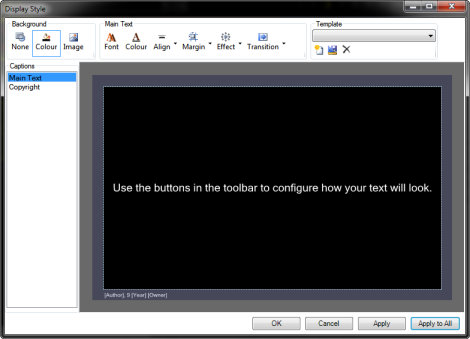

<h1>Configuring the Appearance</h1>

To Configure the Appearance of a Song Clip, right-click the clip in 
 the Main Dashboard and choose Display Options. (Alternatively, you may 
 edit the clip and choose Tools &gt; Display 
 Options from the Cue dialog.)

The Display Style dialog should 
 open.

This dialog will allow you to configure the appearance of your songs. 
 If you are wondering why the dialog has the different colored areas, <a 
	 href="http://en.wikipedia.org/wiki/Title_safe" target="_blank">click 
 here</a>.

&#160;

<table style="margin-left: 24px; border-collapse: separate; border-collapse: separate;" 
		 cellspacing="0" border="1">
	<col>
	<col>
	<tr>
		<td colspan="2" bgcolor="#C0C0C0">Background</td>
		
	</tr>
	<tr>
		<td class="hcp3">
None
</td>
		<td>Clicking None chooses no background at all. If you want a Transparent 
		 background, click None. This is useful for using with layers or 
		 for presenting text over video. 
		 &#160;</td>
	</tr>
	<tr>
		<td class="hcp3">
Colour
</td>
		<td>This is the default and the color is black. Clicking the Colour 
		 icon will cause a Windows color chooser to present. From there 
		 you may choose the desired color. When you choose a color it will 
		 also update the preview. 
		 &#160;</td>
	</tr>
	<tr>
		<td class="hcp3">
Image
</td>
		<td>Clicking Image allows you to browse to and choose an image 
		 to be used. jpg, png, and bmp’s are supported. Note that whatever 
		 image you choose will be scaled to fill the screen. Additionally, 
		 if the image is configured with a transparent background, the 
		 transparency is respected. Although the filter doesn't list them, 
		 .gif images appear to work here. .gif transparency also appears 
		 to be respected. Animated images are not supported. 
		 &#160; 
		 If you wish to remove an image, click the Color 
		 icon. 
		 &#160;</td>
	</tr>
	<tr>
		<td colspan="2" bgcolor="#C0C0C0">Main 
		 Text</td>
		
	</tr>
	<tr>
		<td class="hcp3">
Font
</td>
		<td>Click here to change the Font characteristics of the Text. 
		 
		 &#160;</td>
	</tr>
	<tr>
		<td class="hcp3">
Colour
</td>
		<td>Changes the color of the displayed Font. 
		 &#160;</td>
	</tr>
	<tr>
		<td class="hcp3">
Align
</td>
		<td>Clicking this box gives you alignment options for the displayed 
		 Font. 
		 &#160;</td>
	</tr>
	<tr>
		<td class="hcp3">
Margin
</td>
		<td>Sets the margins or borders around the Song or Copyright information. 
		 
		 &#160;</td>
	</tr>
	<tr>
		<td class="hcp3">
Effect
</td>
		<td>When displaying song words over an image background you often 
		 need an effect such as drop shadow or text outline to ensure the 
		 words stand out. This gives you the option to add both an outline 
		 and drop shadow to the text. Both effects are highly configurable 
		 to ensure you get exactly the effect you want. 
		 &#160;</td>
	</tr>
	<tr>
		<td class="hcp3">
Transition
</td>
		<td>You can set the time taken for the song words to transition 
		 from one verse to the next. You have four speed options &quot;No 
		 Transition&quot;, &quot;Fast Transition&quot;, &quot;Normal Transition&quot; 
		 and &quot;Slow Transition&quot;. 
		 &#160;</td>
	</tr>
	<tr>
		<td colspan="2" bgcolor="#C0C0C0">Template</td>
		
	</tr>
	<tr>
		<td class="hcp3">
Load
</td>
		<td>Clicking this icon allows you to load a template. 
		 &#160;</td>
	</tr>
	<tr>
		<td class="hcp3">
Save
</td>
		<td>Clicking this icon allows you to save a template. You may wish 
		 to have different templates that provide different color backgrounds 
		 or background images. For example, at Easter there might be one 
		 background and at Christmas another. Or perhaps a song targeted 
		 at children has one background while a song for adults has another. 
		 
		 &#160;</td>
	</tr>
</table>

