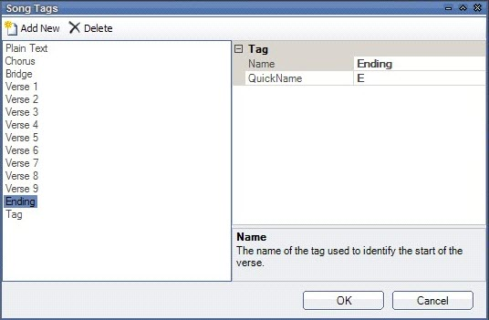
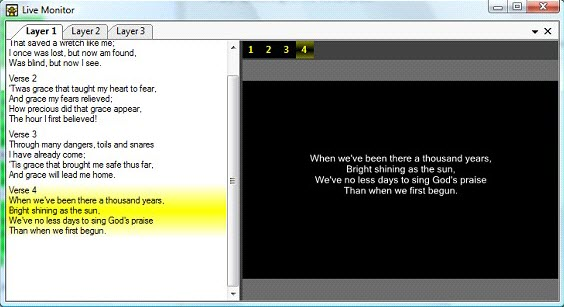

	

<h1> 
 Song Clip</h1>
<h2>What a Song Clip does</h2>

Song Clips are used to present song lyrics on the screen as individual 
 verses. This clip type Includes a song editor to quickly enter the lyrics 
 for the song you want to display. It also has the ability to easily see 
 the lyrics you are displaying and to easily skip to the correct verse 
 in the song.

A range of display options are available to customize how the audience 
 sees the lyrics. You may also search a folder containing lyrics to easily 
 add a song from a database of files.

&#160;

<h2>How to add and configure a Song Clip</h2>

To add a Song clip, click or right-click the desired slot and select 
 Song. 

This will present the Song Edit 
 dialog.

The action you take next depends on whether you have existing songs 
 or you are totally new to Screen Monkey and you need to create a database 
 of songs.

<ul type="disc">
	<li>
If you have existing songs, <a href="SearchingForSongs.md">click 
	 here</a> to view the topic on Searching 
	 for Songs.
</li>
	<li>
If you need to create one or more songs, <a href="CreatingSongClips.md">click 
	 here</a> to view the topic on Creating Song Clips.
</li>
</ul>

&#160;

<h2>Custom Verse Tags</h2>

When you create a Song clip, there are 12 verse tags available. 
 You may change these tags or add more tags to the list. This allows you 
 to customize the default tags of Verse 1-9, Chorus and Bridge. 

To create your own tags. Open the song for editing and 
 from the Tools menu select &quot;Song Tags&quot;. You have the option 
 to add new tags or edit old ones.

&#160;

<h2>How to use a Song Clip during a show</h2>

Click the Song Clip to begin presenting it. The first verse will display. 
 Repeated clicks will present the subsequent verses.

If you use the Live Monitor, the lyrics for the whole song and a preview 
 of the current output will be presented in the Live Monitor area. The 
 current verse is highlighted and you can jump to verses simply by clicking 
 on the verse lyrics.

<table style="margin-left: 12px; border-collapse: separate; border-collapse: separate;" 
		 cellspacing="0" border="1">
	<col>
	<col>
	<tr>
		<td></td>
		<td>You can advance the songs though the verses by using the keyboard 
		 arrow keys. An easy way to advance to the Next/Previous song, 
		 is to configure a hotkey in the <a href="../../Setup/Settings/Settings.md">Scren 
		 Monkey settings</a> Layer Playback section, for Clip Forward and 
		 Clip Reverse.</td>
	</tr>
</table>

You may wish to assign a keyboard key to jump to specific verses in 
 a song. This is useful when you are displaying songs and do not know what 
 order the verses will be sung in. Now you can assign keys to all the verses 
 and when that key is pressed it will jump straight to that verse. This 
 can be set up in the settings under Mouse and Keyboard and MIDI

&#160;

<h2 class="rvps3">Enhancement History</h2>

<a href="../../../releases/Version_3_1.md#Song_Clip">Version 3.1 - 
 20th March 2008: Song Clip Added and Announced</a>

<a href="../../../releases/Version_3_1.md#Song_Clip_Jump_to_Verse_Hotkey">Version 
 3.1 - 27th March 2008: Song Clip Jump to Verse Hotkey</a> / <a href="../../../releases/Version_3_1.md#Song_Clip_Live_Monitor">Song 
 Clip Live Monitor</a>

<a href="../../../releases/Version_3_1.md#Song_Clip_Image_Background">Version 
 3.1 - 30th March 2008: Song Clip Image Background</a>

<a href="../../../releases/Version_3_1.md#Song_Words_Transition_Speed">Version 
 3.1 - 24th May 2008: Song Words Transition Speed</a> / <a href="../../../releases/Version_3_1.md#Song_Text_Effects">Text 
 Effects</a>

<a href="../../../releases/Version_3_2.md#Song_Clip_Labels">Version 
 3.2 - 18th October 2008: Song Clip Labels</a>

<a href="../../../releases/Version_3_2.md#Song_Clip_Double_Line_Break">Version 
 3.2 - 26th October 2008: Song Clip Double Line Break</a>

<a href="../../../releases/Version_3_2.md#Song_Library_Update">Version 
 3.2 - 16th November 2008: Song Library Update</a> / <a href="../../../releases/Version_3_2.md#Song_License_Text">Song 
 License Text</a>

<a href="../../../releases/Version_3_2.md#WPF_Renderer">Version 3.2 
 - 29th December 2008: WPF Renderer</a>

<a href="../../../releases/Version_3_3.md#Song_Clip_Lyrics_Edit_Copy_Paste_Popup">Version 
 3.3 - 30th July 2009: Song Clip Lyrics Edit Copy/Paste Popup</a> / <a href="../../../releases/Version_3_3.md#Pasting_Lyrics_Removes_Rich_Text_Formatting">Pasting 
 Lyrics Removes Rich Text Formatting</a>

<a href="../../../releases/Version_3_3.md#Custom_Verse_Tags">Version 
 3.3 - 1st August 2009: Custom Verse Tags</a> / <a href="../../../releases/Version_3_3.md#Search_Label_Filter">Search 
 Label Filter</a>

<a href="../../../releases/Version_3_3.md#Effects_Clip">Version 3.3 
 - 8th October 2009: Effects Clip</a>

<a href="../../../releases/Version_3_3.md#Bold_Font_in_Song_Clip">Version 
 3.3 - 18th October 2009: Bold Font in Song Clip</a>

<a href="../../../releases/Version_3_4.md#CustomSongTagInteractions">Version 
 3.4 - June 2010: Custom Song Tag Interactions</a>

<a href="../../../releases/Version_3_5.md#Song_Thumbnail_Update">Version 
 3.5 - August 2010: Song Thumbnail Update</a>

<a href="../../../releases/Version_3_5.md#Song_Clip_Improvements">Version 
 3.5 - November 2010: Song Clip Improvements</a>

<a href="../../../releases/Version_3_6.md#Foreign_Character_Sets_in_Songs">Version 
 3.6 - April 2011: Foreign Character Sets in Songs</a>

<a href="../../../releases/Version_3_6.md#Song_Clip_Search_Focus">Version 
 3.6 - June 2011: Song Clip Search Focus</a>

<a href="../../../releases/Version_3_7.md#SongClipHighCPU">Version 
 3.7 - December 2011: Song Clip High CPU</a>

