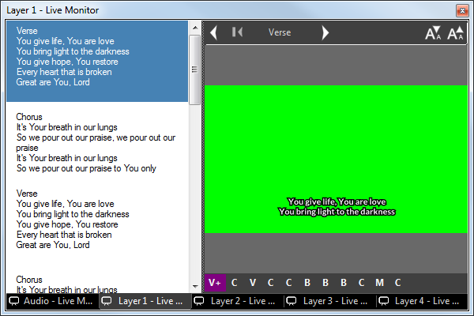

 
# Song Clip

Song Clips are used to present song lyrics on the screen as individual verses or sections. This clip type includes a [song editor](SongEditor.md) to quickly enter the lyrics for the song you want to present and a [display editor](SongDisplay.md) to configure exactly how the lyrics appear. In playback you can quickly and easily select to the correct section of the song to display.

You may search a folder containing lyrics to easily add a song from a local XML database of files or import songs and service plans from an online service such as [Planning Center](../planningCenter.md).

## How to add a Song Clip
To add a Song clip, click the desired slot and select the Song clip type. This will present the Song Edit dialog which will be empty.

You now have a few options:

- you have existing [local songs you want to search for](SongSearch.md)
- you need to [create one or more local songs](SongEditor.md)
- you wish to import from [Planning Center online services](../planningCenter.md)
- you want to [configure the way songs are presented on screen](SongDisplay.md)

## How to use a Song Clip
Songs are divided into sections and pages. Sections are identified by specific phrases in the text, such as 'Chorus' or 'Verse 1'. Pages are created automatically to ensure the text fits onto the screen in the font size specified. Depending on the song makeup each section may require one or more pages. 

In the example below the [display settings](SongDisplay.md) for the song only allow 2 lines to be shown on the screen so section 1 (verse 1) is split into multiple pages.

Click the Song Clip to begin presenting it. The first section will display. Repeated clicks will present the subsequent pages and sections.

In the Live Monitor the lyrics for the whole song and a preview of the current output will be displayed. The current section is highlighted and you can jump to other sections simply by clicking on the lyrics.

You can advance the song though the sections by using the keyboard arrow keys.

You may wish to assign a keyboard key to jump to specific section in a song. This is useful when you are displaying songs and do not know what order the sections will be sung in. You can assign keys to all the sections and when that key is pressed it will jump straight to that section. This is configured in the [Mouse and Keyboard](../../Settings/MouseandKeyboard.md) settings.

