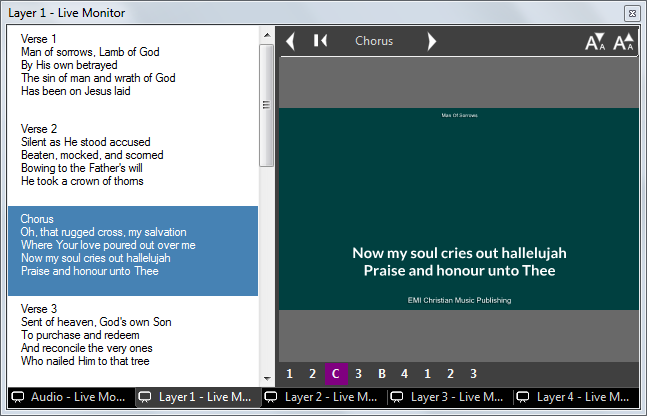
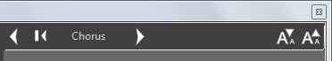
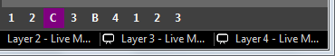

 
# Song Clip

Song Clips are used to present song lyrics on the screen as individual verses or sections. This clip type includes a [song editor](SongEditor.md) to quickly enter the lyrics for the song you want to present and a [display editor](SongDisplay.md) to configure exactly how the lyrics appear. In playback you can quickly and easily select to the correct section of the song to display.

You may search a folder containing lyrics to easily add a song from a local XML database of files or import songs and service plans from an online service such as [Planning Center](../planningCenter.md).

## How to add a Song Clip
To add a Song clip, click the desired slot and select the Song clip type. This will present the Song Edit dialog which will be empty.

You now have a few options:

- you have existing [local songs you want to search for](SongSearch.md)
- you need to [create one or more local songs](SongEditor.md)
- you wish to import from [Planning Center online services](../planningCenter.md)
- you want to [configure the way songs are presented on screen](SongDisplay.md)

## How to use a Song Clip
Songs are divided into Sections and Pages. 

**Sections** are identified by specific phrases in the text, such as 'Chorus' or 'Verse 1' which you type into the editor. The order and arrangement of Sections is determined by the QuickName sequence. 

**Pages** are created automatically to ensure the text fits onto the screen in the font size and within the margins specified. Depending on the song makeup each section will require one or more pages. 

In the example below the [display settings](SongDisplay.md) for the song only allow two lines to be shown on the screen so every section is split into multiple pages.

Click the Song Clip in the dashboard to begin presenting it. The first page will display. Repeated clicks on the clip icon will present the subsequent pages and sections.

It is recommended to use the Live Monitor so you can preview the lyrics for the whole song. The current section is highlighted and you can jump to other sections simply by clicking on the lyrics in the Live Monitor. To show the next page of a section click again on that section.

There are aditional ways to navigate the song. Along the top are left and right arrow buttons. Click these to move forward and backward through the pages. Next to the left arrow is the Restart Verse button which will display Page 1 of the current section.

Also, at the bottom the QuickNames for the song sections are shown in sequence order, click any of these to jump to that section. 

You can move forwards and backwards through the song pages by using the keyboard arrow left and right keys.

You may wish to assign a keyboard key to a specific section in a song. This is useful when you are displaying songs and do not know what order the sections will be sung in. You can assign keys to all the sections and when that key is pressed it will jump straight to that section. This is configured in the [Mouse and Keyboard](../../Settings/MouseandKeyboard.md) settings.

## Playback Settings
To access the Playback Settings right click on the Song clip dashboard icon. By default the clip is set to auto-rewind so that re-cueing the clip will always display Page 1. Alternatively if you disable this setting the clip will continiue from the last Page when re-cued.

## Export Options
A song clip can be exported in a few ways. 

- Cue sheet XML (single file)
- Enhanced podcast chapter album art with XML (zip archive)
- Image files with XML (zip archive)

To export the clip right click on the dashboard icon and then choose 'Export Cue Sheet'. A new dialog opens which allows you to choose cue list and then the type of export you require.  
