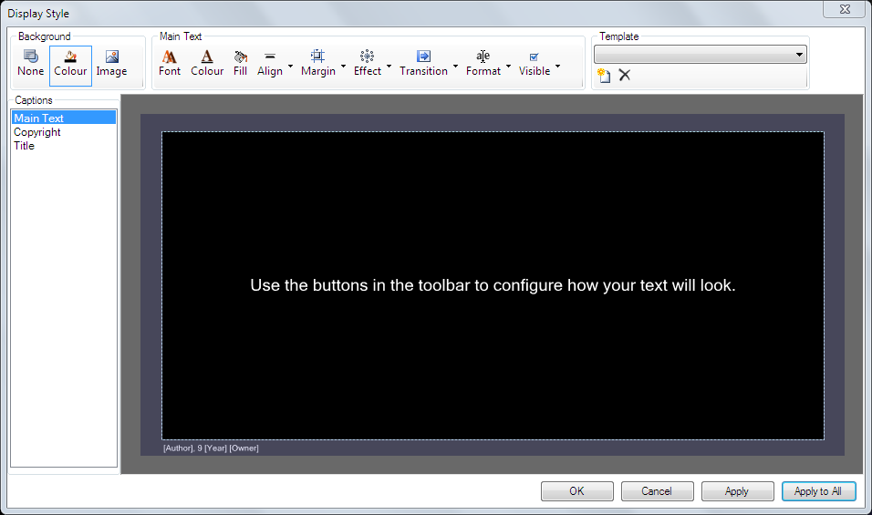
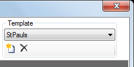

# Song Display Style

To change the style and format of presented song words use the Display Style Editor. There are a lot of similarities between this display editor and the [Text clip](../Text/TextClip.md) so those pages are also worth reading.

## Display Style Editor
To open the Display Style Editor either:

- Right-click the Song clip on the Main Dashboard and choose Display Options
- From within a Song Clip edit dialog choose Tools > Display Options 

This dialog will allow you to configure the appearance of your songs. 

There are four main areas

- Toolbar along the top
- Caption list down the left hand side
- Preview in the remainder of the window
- Bottom row of buttons

## Captions List
Provides a list of the three elements which make up a song clip. 

- **Main Text** is where the lyrics are shown
- **Copyright** an optional line displaying the copyright information (on by default)
- **Title** an optional line displaying the song title (off by default)

Click on an item to select it and then edit the settings for that caption using the toolbar buttons.

## Toolbar
The toolbar is split into three sections - Background, Main Text and Template.

### Background
Defines the background for the song. The same background is used for every page/section.

|Item|Description|
|-|-|
|None|Clicking None sets no background at all, ie, fully transparent. This is useful when using multiple layers to present the song lyrics over video clips.|
|Colour|The default is colour black. Clicking the Colour icon will display a Windows colour picker. From there you may choose the desired background colour.|
|Image|Clicking Image allows you to browse to and choose an image to be used. jpg, png, and bmp’ are supported. Note that whatever image you choose will be scaled to fill the screen. Additionally, if the image is configured with a transparent background, the transparency is respected. Animated images are not supported. If you wish to remove an image, click the Colour or None button.|

### Text Formatting
The following settings are applied to each caption (main text, copyright, title) individually. First select a caption from the list on the left and then use these tools to modify it.

|Item|Description|
|-|-|
|Font|Click here to change the Font and style (bold, italic, etc) of the selected caption.|
|Colour|Changes the text colour of the selected caption.|
|Fill|Allows you to fill any of the caption objects with a solid background colour. This fill has a transparency setting which is useful when overlaying songwords on video.|
|Align|Clicking this box gives you nine alignment options for aranging the text within the frame. The icons give an indication of how the text will be laid out.|
|Margin|Allows you to set the four margins (top, bottom, left, right) from the edges of the screen to the selected caption frame.|
|Effect|This section gives you two effect options - Drop Shadow and Outline. Both are configurable in terms of opacity and colour. To disable the Drop Shadow set the Opacity to minimum (far left).|
|Transition|You can set the time taken for the song words to transition (disolve) from one page to the next. There are four speed options None, Fast, Medium and Slow. This setting only applies to 'Main Text'.|
|Format|There are format options which differ for each caption type as described below.|
|Format (Main Text)|Options for enabling or disabling the components of a song - lyrics, chords and verse/section labels. Default is lyrics only which works best when presenting lyrics to an audience. Chords and Labels are useful if displaying to musicians on stage. If you prefer the lyrics to be shown in all caps there is an option to do this automatically.|
|Format (Copyright)|Allows you to determine exactly how the metadata from the song clip is displayed by means of placeholders. The `{copyright}` placeholder is a shortcut for `{author}, © {year} {owner}, {license}` but you are free to use any combination of placeholders and static text. You are able to set the copyright to show on the first slide only.|
|Format (Title)|Allows you to display the song title metadata by using the `{0}` placeholder with any other text of your choice. You are able to set the title to show on the first slide only.|
|Visible|Completely enable or disable the selected caption.|

### Templates
You may wish to have different templates that provide different colour backgrounds or background images. For example, at Easter there might be one background and at Christmas another. Or perhaps a song targeted at children has one background while a song for adults has another.

On the far left of the toolbar a list of templates is shown. By default this list is empty. To add a new template based on the current display settings click the 'New' icon, enter a name, and click ok.

Choosing a template from the dropdown list loads it into the display editor. Any changes made from this point are saved automatically to the template.

To completely remove a template first select it from the dropdown list and then click on the black cross button.

## Buttons
Along the bottom of the widow are four buttons.

|Item|Description|
|-|-|
|OK|Close the dialog and keep changes for the current song clip|
|Cancel|Close the dialog and lose changes| 
|Apply|Make changes to the current song clip but leave the dialog open| 
|Apply to All|Apply these settings to all song clips in the current show. You will be asked to confirm.|
